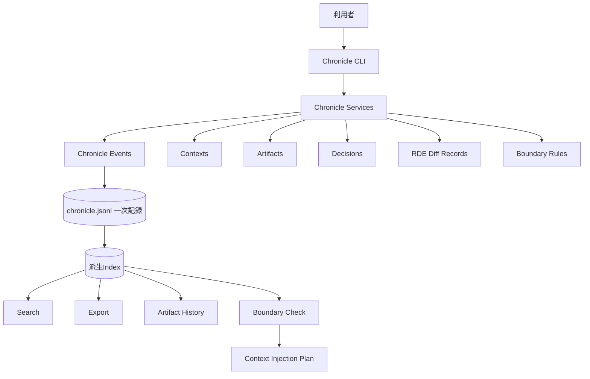

# Chronicle Stack

Chronicle Stack は、AIとの共同作業で生まれる文脈、判断、生成物、差分、出所、境界ルールを、後から再構成できる形で記録する local-first な基盤です。

中心にある価値は **再構成可能性** です。AIとの共同作業では、最終成果物だけでなく、そこに至る文脈、判断、出所、差分、意味変化が後から辿れるべきだと考えます。

## 解決したい課題

AIを使った執筆、設計、調査、開発では、成果物だけが残りやすくなります。しかし、本当に後から必要になるのは、しばしば成果物そのものではなく、そこへ至る過程です。

Chronicle Stack は、次のような情報の喪失を防ぐことを目指します。

- どの文脈から生成されたのか
- どの指示で変更されたのか
- どの案が採用、棄却、保留されたのか
- どの差分が意味を変えたのか
- 出所や根拠がどこにあるのか
- 注意が必要な文脈がいつ混入したのか
- 人間が最終的に何を判断したのか

この問題を、Chronicle Stack では **文脈の喪失**、**判断履歴の喪失**、**生成物の来歴不明化**、**AI memory への過度な依存** として捉えます。

## 目指すもの

Chronicle Stack は、AIにすべてを記憶させるための仕組みではありません。人間側が自分の文脈、問い、判断、生成物の来歴を保持し、必要に応じて選び直せるようにするための基盤です。

主な価値は次の通りです。

- **再構成可能性**: 後から生成過程と判断を辿れる
- **文脈主権**: 文脈をAI任せにせず、人間側で保持・選択する
- **Artifact履歴**: 成果物をバージョンとして追跡する
- **Decision記録**: 採用、棄却、保留の理由を残す
- **RDE Diff Record**: 意味変化を構造的に記録する
- **Source Provenance**: 出所を記録する
- **Boundary Rules**: 文脈の扱いに注意点と境界を与える

## Chronicle Stack ではないもの

Chronicle Stack は、汎用ベクトルデータベース、完成済みのGraphRAG、正しさを自動判定する仕組み、クラウド型AIメモリサービス、LLMエージェント実行基盤ではありません。

RDEは意味変化を構造的に記録するための枠組みですが、正しさを証明するものではありません。Boundary Rules は文脈利用の警告や分類を支援するものですが、強制的な保護機構ではありません。

## システム全体像



`chronicle.jsonl` が一次記録です。派生Indexは、検索、エクスポート、履歴表示、Boundary Check のために再構築される補助データです。

詳細は [アーキテクチャ](docs/architecture.md) を参照してください。

## 現在の状態

| 領域 | 状態 |
|---|---|
| JSONL一次記録 | v0.1完了 |
| Artifact履歴 | v0.1完了 |
| Decision記録 | v0.1完了 |
| RDE Diff Record | v0.1完了 |
| Context Scope Model | v0.2実装済み |
| Visibility Hint | v0.2実装済み |
| Source Provenance | v0.2実装済み |
| Boundary Rules | v0.2実装済み |
| Context Injection Plan | v0.2実装済み |
| GraphRAG | 将来構想 |
| Dashboard | 将来構想 |

## インストール

```bash
pip install -e ".[dev]"
```

## クイックスタート

```bash
chronicle init --title "My Project"
chronicle record --type user_input --actor user --summary "仕様書を作成する"
chronicle add-context --title "Task Context" --summary "このタスクだけで使う文脈" --scope task --visibility private
chronicle artifact create --title "Basic Spec" --type specification --file docs/spec.md --visibility private
chronicle search "Decision Model"
chronicle injection plan --task "Draft v0.2 release notes"
chronicle export --format yaml
chronicle show
```

## 重要な動作仕様

- `.chronicle/chronicle.jsonl` が一次記録です。
- `indexes/` は再構築可能な派生データです。
- `ArtifactVersion.source_event_id` は、それを記録したイベントを指します。
- `Decision.event_id` は、その判断を記録したイベントを指します。
- Artifactの更新には `--file` または明示的なcontent指定が必要です。
- RDEは意味変化の構造化記録であり、正しさの判定ではありません。
- Boundary Rules は助言的な分類であり、強制的な保護機構ではありません。

## ドキュメント

最初に読む文書:

- [アーキテクチャ](docs/architecture.md)
- [インターフェース契約](docs/interface-contracts.md)
- [GraphRAG 接続境界](docs/graphrag-boundary.md)
- [ライセンス方針](docs/licensing.md)
- [AGPL遵守ガイド](docs/agpl-compliance-guide.md)
- [商標・名称利用ポリシー](docs/trademark-policy.md)
- [商用サポート・Enterprise契約範囲](docs/commercial-support-scope.md)
- [CLI リファレンス](docs/cli-reference.md)
- [データモデル](docs/data-model.md)
- [ストレージ形式](docs/storage-format.md)
- [テスト戦略](docs/testing-strategy.md)
- [v0.2 バックログ](docs/backlog-v0.2.md)
- [v0.2 スモークテスト](docs/smoke-test-v0.2.md)
- [v0.2 リリース判定](docs/release-readiness-v0.2.md)

仕様書:

- [基本仕様書](docs/specs/chronicle-stack-basic-spec-v0.1.md)
- [Chronicle Event Model 仕様書](docs/specs/chronicle-event-model-spec-v0.1.md)
- [Artifact Model 仕様書](docs/specs/artifact-model-spec-v0.1.md)
- [Decision Model 仕様書](docs/specs/decision-model-spec-v0.1.md)
- [RDE Diff Record 仕様書](docs/specs/rde-diff-record-spec-v0.1.md)

## 貢献

- [CONTRIBUTING.md](CONTRIBUTING.md)

## 開発

```bash
pytest
ruff check src/ tests/
```

## 変更履歴

- [CHANGELOG.md](CHANGELOG.md)

## リリース

- Latest release: **v0.2.0**
- GitHub Release: https://github.com/zyx-corporation/chronicle-stack/releases/tag/v0.2.0

## ライセンス

Chronicle Stack v0.2.0 以降は GNU Affero General Public License v3.0 or later（AGPL-3.0-or-later）で提供します。

過去に異なる条件で公開されたリリースの利用条件は、この変更によって遡及的に変更されません。

AGPL版では、Chronicle Stackを改変してネットワークサービスとして提供する場合にも、利用者が対応するソースコードへアクセスできるようにすることを重視します。

商用利用、閉源組み込み、SaaS提供、または別条件での利用については、ZYX Corp株式会社との個別契約により商用ライセンスを提供する場合があります。
