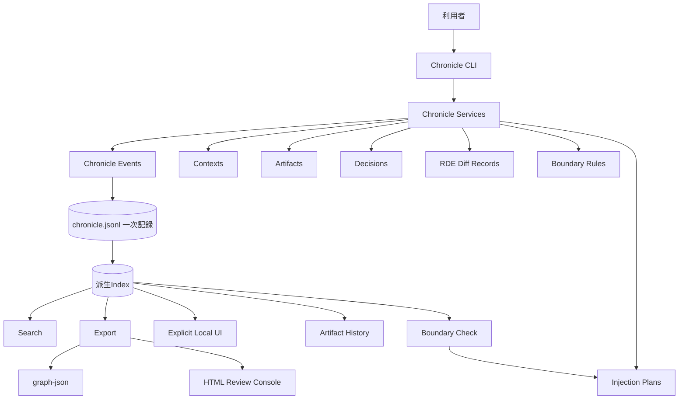

# Chronicle Stack

Chronicle Stack は、AIとの共同作業で生まれる文脈、判断、生成物、差分、出所、境界ルールを、後から再構成できる形で記録する local-first な基盤です。

中心にある価値は **再構成可能性** です。AIとの共同作業では、最終成果物だけでなく、そこに至る文脈、判断、出所、差分、意味変化が後から辿れるべきだと考えます。

## 解決したい課題

AIを使った執筆、設計、調査、開発では、成果物だけが残りやすくなります。しかし、本当に後から必要になるのは、しばしば成果物そのものではなく、そこへ至る過程です。

Chronicle Stack は、次のような情報の喪失を防ぐことを目指します。

- どの文脈から生成されたのか
- どの指示で変更されたのか
- どの案が採用、棄却、保留されたのか
- どの差分が意味を変えたのか
- 出所や根拠がどこにあるのか
- 注意が必要な文脈がいつ混入したのか
- 人間が最終的に何を判断したのか

この問題を、Chronicle Stack では **文脈の喪失**、**判断履歴の喪失**、**生成物の来歴不明化**、**AI memory への過度な依存** として捉えます。

## 目指すもの

Chronicle Stack は、AIにすべてを記憶させるための仕組みではありません。人間側が自分の文脈、問い、判断、生成物の来歴を保持し、必要に応じて選び直せるようにするための基盤です。

主な価値は次の通りです。

- **再構成可能性**: 後から生成過程と判断を辿れる
- **文脈主権**: 文脈をAI任せにせず、人間側で保持・選択する
- **Artifact履歴**: 成果物をバージョンとして追跡する
- **Decision記録**: 採用、棄却、保留の理由を残す
- **RDE Diff Record**: 意味変化を構造的に記録する
- **Source Provenance**: 出所を記録する
- **Boundary Rules**: 文脈の扱いに注意点と境界を与える
- **Interface Contracts**: JSONL、CLI JSON、exportの安定性を明示する
- **Graph-ready Export**: GraphRAG接続準備用の派生node/edge export
- **Static Dashboard / Review Console**: Chronicle状態を静的HTMLで確認する
- **Explicit Local UI**: `chronicle ui` で明示起動する read-only local web UI
- **Operational Workflows**: classification、audit、lifecycle、package review を local-first に確認する

## Chronicle Stack ではないもの

Chronicle Stack は、汎用ベクトルデータベース、完成済みのGraphRAG、正しさを自動判定する仕組み、クラウド型AIメモリサービス、LLMエージェント実行基盤、ライブDashboardサーバーではありません。

RDEは意味変化を構造的に記録するための枠組みですが、正しさを証明するものではありません。Boundary Rules は文脈利用の警告や分類を支援するものですが、強制的な保護機構ではありません。Graph export はGraphRAG接続準備であり、GraphRAGエンジンではありません。HTML dashboard / Review Console は読み取り専用の派生ビューです。`chronicle ui` は明示起動型のローカル閲覧UIであり、daemon、hosted service、access control、correctness proof ではありません。Package review は診断的な確認であり、正しさの証明ではありません。

## システム全体像



`chronicle.jsonl` が一次記録です。派生Index、検索、エクスポート、履歴表示、Boundary Check、graph-json、HTML Review Console、Explicit Local UI は補助データまたは派生ビューです。

詳細は [アーキテクチャ](docs/architecture.md) と [インターフェース契約](docs/interface-contracts.md) を参照してください。

## 現在の状態

| 領域 | 状態 |
|---|---|
| JSONL一次記録 | v0.1完了 |
| Artifact履歴 | v0.1完了 |
| Decision記録 | v0.1完了 |
| RDE Diff Record | v0.1完了 |
| Context Scope / Visibility / Provenance / Boundary | v0.2実装済み |
| Interface Contracts / Recorded Injection Plans / Graph-ready Export / Static Dashboard | v0.3実装済み |
| Doctor / Export Manifest / Redaction-aware Export / Dashboard filtering / Graph inspection | v0.4実装済み |
| Security-aware Context Metadata | v0.5実装済み |
| Package Persistence / Primary CLI aliases | v0.6実装済み |
| Classification / Audit / Lifecycle workflows | v0.7実装済み |
| Package Review workflow | v0.8実装済み |
| Release Candidate hardening | v0.9.0完了 |
| Stable release criteria / compatibility policy / integration boundary / release execution docs | v1.0.0完了 |
| Static read-first Review Console | v1.1実装済み |
| Explicit local web UI / `chronicle ui` | v1.1実装済み |
| v1.1 GUI/readability release preparation | v1.1.0完了 |
| Read-only UI detail endpoints | v1.2実装済み |
| v1.2 UI drill-down release preparation | v1.2.0完了 |
| Automated read-only UI smoke command | v1.3準備中 |
| GraphRAG query engine | 将来構想 |
| Full interactive editing UI | 将来構想 |

## インストール

開発用:

```bash
pip install -e ".[dev]"
```

ローカル配備用の inspect-first 手順:

```bash
curl -fsSL https://raw.githubusercontent.com/zyx-corporation/chronicle-stack/main/scripts/install-local.sh -o /tmp/chronicle-install-local.sh
less /tmp/chronicle-install-local.sh
bash /tmp/chronicle-install-local.sh
```

簡易 one-liner:

```bash
curl -fsSL https://raw.githubusercontent.com/zyx-corporation/chronicle-stack/main/scripts/install-local.sh | bash
```

詳細は [curl-based Local Deployment](docs/local-deployment-curl.md) を参照してください。

## クイックスタート

```bash
chronicle --version
chronicle init --title "My Project"
chronicle doctor
chronicle record --type user_input --actor user --summary "仕様書を作成する"
chronicle add-context --title "Task Context" --summary "このタスクだけで使う文脈" --scope task --visibility private
chronicle context classification missing
chronicle context classification set --context <CONTEXT_ID> --layer internal --sensitivity internal
chronicle audit record --operation export --purpose "internal review" --target local
chronicle lifecycle record --target <CONTEXT_ID> --target-kind context --action seal
chronicle package review --purpose "Sayane review" --target local --context <CONTEXT_ID>
chronicle artifact create --title "Basic Spec" --type specification --file docs/spec.md --visibility private
chronicle boundary add --type warn --field visibility --operator equals --value sensitive --reason "Review sensitive context"
chronicle injection plan --task "Draft release notes" --record
chronicle export --format yaml
chronicle export profile --format yaml --profile public-review
chronicle package context --purpose "Sayane review" --target local
chronicle export --format graph-json -o graph.json
chronicle export --format html -o chronicle-review-console.html
chronicle ui-smoke
chronicle ui
chronicle graph summary
chronicle context check --target local --purpose "internal review"
chronicle show
```

`chronicle ui` は明示起動型の foreground local web UI です。デフォルトでは `127.0.0.1:8765` に bind し、read-only で現在の Chronicle root を表示します。終了するには terminal で `Ctrl-C` を押します。

`chronicle ui-smoke` は、サーバーを起動せず、ブラウザも使わず、ローカル UI の read-only データ面を検証する smoke command です。`--json` を付けると機械可読の smoke report を出力します。

`chronicle ui` は `/api/overview`, `/api/events`, `/api/contexts`, `/api/artifacts`, `/api/decisions`, `/api/rde`, `/api/boundary`, `/api/audit`, `/api/lifecycle`, `/api/package-review`, `/api/graph-summary` を read-only endpoint として提供します。これらはすべてローカル Chronicle ファイル由来の派生ビューです。

v1.2 では、`/api/events/<id>`, `/api/contexts/<id>`, `/api/artifacts/<id>`, `/api/decisions/<id>`, `/api/rde/<id>`, `/api/boundary/<id>`, `/api/audit/<id>`, `/api/lifecycle/<id>` のような read-only detail endpoint を提供します。これらも記録を変更しない閲覧用の派生ビューです。

補助CLIとして `chronicle-export`, `chronicle-package`, `chronicle-graph`, `chronicle-context`, `chronicle-audit`, `chronicle-lifecycle` も互換目的で維持されています。v0.6 以降の文書例では primary CLI alias を優先します。

## 重要な動作仕様

- `.chronicle/chronicle.jsonl` が一次記録です。
- `indexes/` は再構築可能な派生データです。
- `ArtifactVersion.source_event_id` は、それを記録したイベントを指します。
- `Decision.event_id` は、その判断を記録したイベントを指します。
- Artifactの更新には `--file` または明示的なcontent指定が必要です。
- RDEは意味変化の構造化記録であり、正しさの判定ではありません。
- Boundary Rules は助言的な分類であり、強制的な保護機構ではありません。
- Injection Plan はLLMへの自動注入ではありません。デフォルトでは非永続で、`--record` 指定時のみ記録されます。
- Visibility Hint はアクセス制御やredactionではありません。
- Classification metadata は advisory metadata であり、アクセス制御ではありません。
- Audit events は traceability metadata であり、強制機構ではありません。
- Lifecycle markers は advisory metadata であり、一次記録をそれ自体で変更しません。
- Package review は diagnostic workflow であり、正しさの証明ではありません。
- `graph-json` はGraphRAG接続準備用の派生exportです。
- HTML Review Console は静的・読み取り専用の派生ビューです。
- `chronicle ui` は明示起動型の read-only local web UI であり、daemon、server-by-default、access control、correctness proof ではありません。
- `chronicle ui-smoke` は read-only diagnostic smoke であり、サーバー起動、ブラウザ操作、セキュリティ認証、正しさの証明ではありません。

## ドキュメント

最初に読む文書:

- [アーキテクチャ](docs/architecture.md)
- [インターフェース契約](docs/interface-contracts.md)
- [GraphRAG 接続境界](docs/graphrag-boundary.md)
- [CLI リファレンス](docs/cli-reference.md)
- [curl-based Local Deployment](docs/local-deployment-curl.md)
- [v1.0 Release Criteria and Compatibility Policy](docs/v1-release-criteria-and-compatibility.md)
- [v1.0 Release Status](docs/release-status-v1.0.0.md)
- [v1.0 Release Readiness](docs/release-readiness-v1.0.md)
- [v1.0 Smoke Test Profile](docs/smoke-test-v1.0.md)
- [v1.0 CLI Compatibility Audit](docs/v1-cli-compatibility-audit.md)
- [v1.0 Sayane / CSG-RAG Integration Boundary](docs/v1-integration-boundary-sayane-csg-rag.md)
- [v1.0 Release Execution Plan](docs/release-execution-v1.0.0.md)
- [v1.0 Release Notes](docs/release-notes-v1.0.0.md)
- [v1.1 Review Console Plan](docs/v1.1-review-console-plan.md)
- [v1.1 Local Web UI Design](docs/v1.1-local-web-ui-design.md)
- [v1.1 Smoke Test Profile](docs/smoke-test-v1.1.md)
- [v1.1 Release Readiness](docs/release-readiness-v1.1.md)
- [v1.1 Release Notes](docs/release-notes-v1.1.0.md)
- [v1.2 Smoke Test Profile](docs/smoke-test-v1.2.md)
- [v1.2 Release Readiness](docs/release-readiness-v1.2.md)
- [v1.2 Release Notes](docs/release-notes-v1.2.0.md)
- [v0.6 Release Deployment Procedure](docs/release-deployment-v0.6.md)
- [v0.7 Operational Hardening Plan](docs/v0.7-operational-hardening-plan.md)
- [v0.8 Package Review Workflow](docs/v0.8-package-review-workflow.md)
- [v0.9 Release Deployment Procedure](docs/release-deployment-v0.9.md)
- [データモデル](docs/data-model.md)
- [ストレージ形式](docs/storage-format.md)
- [テスト戦略](docs/testing-strategy.md)
- [Doctor Security Checks](docs/doctor-security-checks.md)
- [ADR Index](docs/adr/README.md)

契約・運用関連:

- [ライセンス方針](docs/licensing.md)
- [AGPL遵守ガイド](docs/agpl-compliance-guide.md)
- [商標・名称利用ポリシー](docs/trademark-policy.md)
- [商用サポート・Enterprise契約範囲](docs/commercial-support-scope.md)
- [Contributor License Policy](docs/contributor-license-policy.md)

仕様書:

- [基本仕様書](docs/specs/chronicle-stack-basic-spec-v0.1.md)
- [Chronicle Event Model 仕様書](docs/specs/chronicle-event-model-spec-v0.1.md)
- [Artifact Model 仕様書](docs/specs/artifact-model-spec-v0.1.md)
- [Decision Model 仕様書](docs/specs/decision-model-spec-v0.1.md)
- [RDE Diff Record 仕様書](docs/specs/rde-diff-record-spec-v0.1.md)

## 貢献

- [CONTRIBUTING.md](CONTRIBUTING.md)

## 開発

```bash
pytest
ruff check src/ tests/
```

## 変更履歴

- [CHANGELOG.md](CHANGELOG.md)

## リリース

- Latest published release: **v1.2.0**
- Current repository-side release target: **v1.3.0**
- v1.2.0 release readiness: [docs/release-readiness-v1.2.md](docs/release-readiness-v1.2.md)
- v1.2.0 smoke profile: [docs/smoke-test-v1.2.md](docs/smoke-test-v1.2.md)
- v1.2.0 release notes: [docs/release-notes-v1.2.0.md](docs/release-notes-v1.2.0.md)

## ライセンス

AGPL-3.0-or-later. 詳細は [LICENSE](LICENSE) を参照してください。

商用利用、クローズドソース製品への組み込み、SaaS/ホステッドサービスでの利用については、別途商用ライセンスを検討します。`Commercial-SaaS-License.md` と `docs/contributor-license-policy.md` は draft completed / counsel review pending です。
