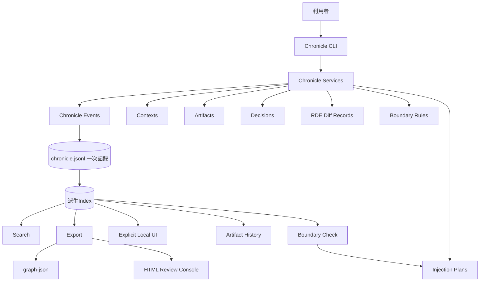

# Chronicle Stack

Chronicle Stack は、AIとの共同作業で生まれる文脈、判断、生成物、差分、出所、境界ルールを、後から再構成できる形で記録する local-first な基盤です。

中心にある価値は **再構成可能性** です。AIとの共同作業では、最終成果物だけでなく、そこに至る文脈、判断、出所、差分、意味変化が後から辿れるべきだと考えます。

## 解決したい課題

AIを使った執筆、設計、調査、開発では、成果物だけが残りやすくなります。しかし、本当に後から必要になるのは、しばしば成果物そのものではなく、そこへ至る過程です。

Chronicle Stack は、次のような情報の喪失を防ぐことを目指します。

- どの文脈から生成されたのか
- どの指示で変更されたのか
- どの案が採用、棄却、保留されたのか
- どの差分が意味を変えたのか
- 出所や根拠がどこにあるのか
- 注意が必要な文脈がいつ混入したのか
- 人間が最終的に何を判断したのか

この問題を、Chronicle Stack では **文脈の喪失**、**判断履歴の喪失**、**生成物の来歴不明化**、**AI memory への過度な依存** として捉えます。

## 目指すもの

Chronicle Stack は、AIにすべてを記憶させるための仕組みではありません。人間側が自分の文脈、問い、判断、生成物の来歴を保持し、必要に応じて選び直せるようにするための基盤です。

主な価値は次の通りです。

- **再構成可能性**: 後から生成過程と判断を辿れる
- **文脈主権**: 文脈をAI任せにせず、人間側で保持・選択する
- **Artifact履歴**: 成果物をバージョンとして追跡する
- **Decision記録**: 採用、棄却、保留の理由を残す
- **RDE Diff Record**: 意味変化を構造的に記録する
- **Source Provenance**: 出所を記録する
- **Boundary Rules**: 文脈の扱いに注意点と境界を与える
- **Interface Contracts**: JSONL、CLI JSON、exportの安定性を明示する
- **Graph-ready Export**: GraphRAG接続準備用の派生node/edge export
- **Static Dashboard / Review Console**: Chronicle状態を静的HTMLで確認する
- **Explicit Local UI**: `chronicle ui` で明示起動する read-only local web UI
- **Operational Workflows**: classification、audit、lifecycle、package review を local-first に確認する

## Chronicle Stack ではないもの

Chronicle Stack は、汎用ベクトルデータベース、完成済みのGraphRAG、正しさを自動判定する仕組み、クラウド型AIメモリサービス、LLMエージェント実行基盤、ライブDashboardサーバーではありません。

RDEは意味変化を構造的に記録するための枠組みですが、正しさを証明するものではありません。Boundary Rules は文脈利用の警告や分類を支援するものですが、強制的な保護機構ではありません。Graph export はGraphRAG接続準備であり、GraphRAGエンジンではありません。HTML dashboard / Review Console は読み取り専用の派生ビューです。`chronicle ui` は明示起動型のローカル閲覧UIであり、daemon、hosted service、access control、correctness proof ではありません。Package review は診断的な確認であり、正しさの証明ではありません。

## システム全体像



`chronicle.jsonl` が一次記録です。派生Index、検索、エクスポート、履歴表示、Boundary Check、graph-json、HTML Review Console、Explicit Local UI は補助データまたは派生ビューです。

詳細は [アーキテクチャ](docs/architecture.md) と [インターフェース契約](docs/interface-contracts.md) を参照してください。

## 現在の状態

| 領域 | 状態 |
|---|---|
| JSONL一次記録 | v0.1完了 |
| Artifact履歴 | v0.1完了 |
| Decision記録 | v0.1完了 |
| RDE Diff Record | v0.1完了 |
| Context Scope / Visibility / Provenance / Boundary | v0.2実装済み |
| Interface Contracts / Recorded Injection Plans / Graph-ready Export / Static Dashboard | v0.3実装済み |
| Doctor / Export Manifest / Redaction-aware Export / Dashboard filtering / Graph inspection | v0.4実装済み |
| Security-aware Context Metadata | v0.5実装済み |
| Package Persistence / Primary CLI aliases | v0.6実装済み |
| Classification / Audit / Lifecycle workflows | v0.7実装済み |
| Package Review workflow | v0.8実装済み |
| Release Candidate hardening | v0.9.0完了 |
| Stable release criteria / compatibility policy / integration boundary / release execution docs | v1.0.0完了 |
| Static read-first Review Console | v1.1実装済み |
| Explicit local web UI / `chronicle ui` | v1.1実装済み |
| v1.1 GUI/readability release preparation | v1.1.0完了 |
| Read-only UI detail endpoints | v1.2実装済み |
| v1.2 UI drill-down release preparation | v1.2.0完了 |
| Automated read-only UI smoke command | v1.3実装済み |
| v1.3 UI smoke release preparation | v1.3.0準備済み |
| Local placeholder AI index CLI surface | v1.7 Phase D 実装済み |
| Read-only UI visibility for placeholder AI index | v1.7 Phase E 相当 実装済み |
| Explicit local runtime summarize MVP | v1.7 Phase F 実装済み |
| Local retrieval dry-run plan MVP | v1.7 Phase G skeleton 実装済み |
| Chronicle Object Expansion / Federation Phase 4 | v1.84.0実装済み |
| Federation Message MVP / Federation Phase 5 | v1.85.0実装済み |
| Node Trust Model / Federation Phase 6 | v1.86.0実装済み |
| Sayane / AI Adapter Integration / Federation Phase 7 | v1.87.0実装済み |
| Context SNS Surface / Federation Phase 8 | v1.88.0実装済み |
| Local Federation Package Foundation / Federation Phase 1 slice | v1.89.0実装済み |
| Signed Manifest and Verification / Federation Phase 2 slice | v1.90.0実装済み |
| Context Boundary and Consent / Federation Phase 3 slice | v1.91.0実装済み |
| Federation Preview and Import-Review Surface | v1.92.0実装済み |
| Federation Boundary and Consent Preflight CLI | v1.93.0実装済み |
| Read-only Federation Package Preview UI Surface | v1.94.0実装済み |
| Federation Preflight Audit Summary Surface | v1.95.0実装済み |
| Consent Overlap Summaries on Review and Runtime Read Models | v1.96.0実装済み |
| Overview Federation Overlap Summary Panel | v1.97.0実装済み |
| Overview Federation Detail Shortcut Panel | v1.98.0実装済み |
| Overview Federation Boundary-Check Template Panel | v1.99.0実装済み |
| Overview Federation Preview-Package Template Panel | v1.100.0実装済み |
| Overview Federation Import-Preview Template Panel | v1.101.0実装済み |
| Overview Federation Package-Inspect Template Panel | v1.102.0実装済み |
| Overview Federation Package-Verify Template Panel | v1.103.0実装済み |
| Overview Federation CLI Guidance Grouping | v1.104.0実装済み |
| v1.8 local GUI review-route contract hardening release preparation | v1.8.0準備済み |
| GraphRAG query engine | 将来構想 |
| Full interactive editing UI | 将来構想 |

## インストール

開発用:

```bash
pip install -e ".[dev]"
```

ローカル配備用の inspect-first 手順:

```bash
curl -fsSL https://raw.githubusercontent.com/zyx-corporation/chronicle-stack/main/scripts/install-local.sh -o /tmp/chronicle-install-local.sh
less /tmp/chronicle-install-local.sh
bash /tmp/chronicle-install-local.sh
```

簡易 one-liner:

```bash
curl -fsSL https://raw.githubusercontent.com/zyx-corporation/chronicle-stack/main/scripts/install-local.sh | bash
```

詳細は [curl-based Local Deployment](docs/local-deployment-curl.md) を参照してください。

## クイックスタート

```bash
chronicle --version
chronicle init --title "My Project"
chronicle doctor
chronicle record --type user_input --actor user --summary "仕様書を作成する"
chronicle add-context --title "Task Context" --summary "このタスクだけで使う文脈" --scope task --visibility private
chronicle context classification missing
chronicle context classification set --context <CONTEXT_ID> --layer internal --sensitivity internal
chronicle audit record --operation export --purpose "internal review" --target local
chronicle lifecycle record --target <CONTEXT_ID> --target-kind context --action seal
chronicle package review --purpose "Sayane review" --target local --context <CONTEXT_ID>
chronicle artifact create --title "Basic Spec" --type specification --file docs/spec.md --visibility private
chronicle boundary add --type warn --field visibility --operator equals --value sensitive --reason "Review sensitive context"
chronicle injection plan --task "Draft release notes" --record
chronicle export --format yaml
chronicle export profile --format yaml --profile public-review
chronicle package context --purpose "Sayane review" --target local
chronicle package query-engine-adapter --query "What context should a downstream query engine inspect?"
chronicle package query-engine-bundle --query "What context should a downstream query engine inspect?" --output-dir handoff-bundle
chronicle export --format graph-json -o graph.json
chronicle export --format html -o chronicle-review-console.html
chronicle ai-index status
chronicle ai-index vector add --record <EVENT_ID> --text "placeholder local search text" --type event
chronicle ai-index vector search --query "local search"
chronicle ai-index graph add-node --id <EVENT_ID> --label event
chronicle ai-index graph neighbors --id <EVENT_ID>
chronicle runtime status
chronicle runtime summarize --text "Long source text to summarize locally" --record
chronicle runtime retrieve-plan --query "What context should I use?"
chronicle runtime retrieve-plan --query "What context should I use?" --record
chronicle object record --type question --summary "Why does this policy exist?" --created-by user
chronicle object list
chronicle object show --id <OBJECT_ID>
chronicle federation message create --type request_context --source-node node:local:alpha --target-node node:local:beta --purpose "project review"
chronicle federation inbox inspect
chronicle federation outbox inspect
chronicle federation package create --purpose "project review" --target-node node:partner:beta --visibility federated --output-dir federation-package
chronicle federation package create --purpose "project review" --target-node node:partner:beta --visibility federated --signature-mode local_dev --signature-expires-at 2026-12-31T00:00:00+00:00 --output-dir federation-package-signed
chronicle federation package create --purpose "project review" --target-node node:partner:beta --consent-granted-by reviewer --consent-recorded-at 2026-06-28T08:00:00+00:00 --consent-scope project-review --no-third-party-sharing --third-party-sharing-reason "partner-only review" --output-dir federation-package-consent
chronicle federation package inspect --package-dir federation-package
chronicle federation package verify --package-dir federation-package
chronicle federation package preview --package-dir federation-package
chronicle federation package import-preview --package-dir federation-package
chronicle federation boundary check --purpose "project review" --target-node node:partner:beta --context <CONTEXT_ID> --visibility federated
chronicle federation consent record --target-node node:partner:beta --purpose "project review" --scope project-review --granted-by reviewer --no-third-party-sharing --third-party-sharing-reason "partner-only review"
chronicle trust node add --node-id node:partner:beta --subject-id subject:beta
chronicle trust assert --target-node node:partner:beta --domain technical_review --purpose "project review" --level trusted --capability review
chronicle trust list
chronicle review queue
chronicle review approve --event <EVENT_ID> --reviewer <NAME>
chronicle review reject --event <EVENT_ID> --reviewer <NAME>
chronicle review request-changes --event <EVENT_ID> --reviewer <NAME>
chronicle artifact apply-proposal --event <PROPOSAL_EVENT_ID>
chronicle context apply-proposal --event <PROPOSAL_EVENT_ID>
chronicle ui-smoke
chronicle ui-smoke --json
chronicle ui
chronicle graph summary
chronicle context check --target local --purpose "internal review"
chronicle show
```

`chronicle ui` は明示起動型の foreground local web UI です。デフォルトでは `127.0.0.1:8765` に bind し、read-only で現在の Chronicle root を表示します。現段階では auth/authz 未実装のため loopback host (`127.0.0.1`, `localhost`, `::1`) のみ許可します。`--auth-mode` と `--authorization-mode` は現時点では placeholder config surface で、UI boundary と assurance 表示に反映されます。終了するには terminal で `Ctrl-C` を押します。

`chronicle ui-smoke` は、サーバーを起動せず、ブラウザも使わず、ローカル UI の read-only データ面を検証する smoke command です。`--json` を付けると機械可読の smoke report を出力します。

`chronicle ui` は `/api/overview`, `/api/events`, `/api/contexts`, `/api/chronicle-objects`, `/api/federation-inbox`, `/api/federation-outbox`, `/api/trust-nodes`, `/api/trust-relations`, `/api/artifacts`, `/api/decisions`, `/api/rde`, `/api/boundary`, `/api/audit`, `/api/lifecycle`, `/api/runtime-records`, `/api/review-queue`, `/api/ui-boundary`, `/api/package-review`, `/api/federation-package-preview`, `/api/graph-summary`, `/api/ai-index-status`, `/api/ai-index-vector`, `/api/ai-index-graph-nodes`, `/api/ai-index-graph-edges` を read-only endpoint として提供します。これらはすべてローカル Chronicle ファイル由来の派生ビューです。

v1.2 以降では、`/api/events/<id>`, `/api/contexts/<id>`, `/api/artifacts/<id>`, `/api/decisions/<id>`, `/api/rde/<id>`, `/api/boundary/<id>`, `/api/audit/<id>`, `/api/lifecycle/<id>`, `/api/runtime-records/<id>`, `/api/review-queue/<id>` のような read-only detail endpoint を提供します。これらも記録を変更しない閲覧用の派生ビューです。

`/api/review-queue` は `review_status=needs_review` の記録を preview-only で表示します。UI mutation は有効化されず、CLI family の目安表示だけを返します。detail では reviewer event と linked audit event の履歴 timeline に加え、current UI boundary と照合した identity assurance、および review capability/warning surface を notice 表示で確認できます。`reviewer_enforcement_summary` では、現在の reviewer/session 条件のうち「write route で強制されるもの」と「read-only surface 上で説明的に見せているだけのもの」を分けて確認できます。warning code は説明文へ展開されます。

`/api/ui-boundary` は現在の GUI mutation capability flag, bind scope, auth/authz 未実装状態を read-only に可視化します。`reviewer_enforcement_summary` は reviewer/session 境界の enforcement scope を構造化して返し、`reviewer_validation_gate_summary` は validation/gate failure family をまとめて返します。read-only UI surface 自体は authority を付与しないことも明示します。

`chronicle review` は append-only reviewer event を追加する CLI parity skeleton です。approve / reject / request-changes は target event を直接書き換えず、reviewer event を追記し、同時に `review_decision` audit event も残します。reviewer identity は `label`, `kind`, `session` の構造で保持され、将来の auth/authz 接続点になります。

補助CLIとして `chronicle-export`, `chronicle-package`, `chronicle-graph`, `chronicle-context`, `chronicle-audit`, `chronicle-lifecycle` も互換目的で維持されています。v0.6 以降の文書例では primary CLI alias を優先します。

## 重要な動作仕様

- `.chronicle/chronicle.jsonl` が一次記録です。
- `indexes/` は再構築可能な派生データです。
- `ArtifactVersion.source_event_id` は、それを記録したイベントを指します。
- `Decision.event_id` は、その判断を記録したイベントを指します。
- Artifactの更新には `--file` または明示的なcontent指定が必要です。
- RDEは意味変化の構造化記録であり、正しさの判定ではありません。
- Boundary Rules は助言的な分類であり、強制的な保護機構ではありません。
- Injection Plan はLLMへの自動注入ではありません。デフォルトでは非永続で、`--record` 指定時のみ記録されます。
- Visibility Hint はアクセス制御やredactionではありません。
- Classification metadata は advisory metadata であり、アクセス制御ではありません。
- Audit events は traceability metadata であり、強制機構ではありません。
- Lifecycle markers は advisory metadata であり、一次記録をそれ自体で変更しません。
- Package review は diagnostic workflow であり、正しさの証明ではありません。
- `graph-json` はGraphRAG接続準備用の派生exportです。
- HTML Review Console は静的・読み取り専用の派生ビューです。
- `chronicle ui` は明示起動型の read-only local web UI であり、daemon、server-by-default、access control、correctness proof ではありません。
- `chronicle ui-smoke` は read-only diagnostic smoke であり、サーバー起動、ブラウザ操作、セキュリティ認証、正しさの証明ではありません。
- `chronicle runtime summarize` は明示実行型の local placeholder summarize であり、外部 LLM 呼び出しではありません。生成出力は review 前提です。
- `chronicle runtime retrieve-plan` は dry-run の retrieval plan 表示であり、GraphRAG runtime や外部検索サービスではありません。
- `chronicle runtime retrieve-plan --record` は retrieval dry-run 計画を review 前提の `assistant_output` event として記録します。
- `chronicle object record` は Question / Objection / Hypothesis / Decay などの意味単位を append-only event として記録します。
- `/api/chronicle-objects` は explicit object records と、Artifact / Decision / RDE / Context から派生した object view を read-only に表示します。
- `chronicle federation message create` は preview-only の federation message envelope を local inbox/outbox queue に保存します。
- `chronicle federation inbox inspect` と `/api/federation-inbox` は受信 message を preview/review 用に読むだけで、自動 import や local primary-record 変更は行いません。
- `chronicle federation package create` は local-first な handoff bundle を directory として生成しますが、network transport、auto-apply、hosted sync は追加しません。
- `chronicle federation package create --signature-mode local_dev` は reviewable な local dev signed-manifest surface を追加できますが、trust certification や本人性証明を与えるものではありません。
- `chronicle federation package create` は consent metadata、visibility mapping、third-party sharing restriction を advisory metadata と audit に残せますが、法的同意管理や access control を自動化するものではありません。
- `chronicle federation package verify` は bundle file hash と signed-manifest surface を検証しますが、署名済み trust や真正性証明そのものではありません。
- `chronicle federation package preview` と `import-preview` は verify 結果を読み取り専用の advisory review として束ねますが、Chronicle primary records を上書きしたり import を自動実行したりしません。
- `/api/federation-package-preview` は `package_dir` query parameter で明示指定されたローカル bundle directory だけを preview / import-preview 表示し、package 作成や persistence を暗黙に行いません。
- `/api/audit` と overview の `federation_preflight_summary` は consent-record audit metadata を read-only に要約し、boundary check は引き続き CLI-only preflight であることを明示します。
- `review_queue` と `runtime_records` の `matching_federation_consent_summary` は、対象 read model が参照する record と重なる最新 consent audit を advisory に示しますが、package 作成・transport・import を許可するものではありません。
- overview の `federation_overlap_summary` は runtime/review read model 上の consent overlap 件数を advisory に要約しますが、consent enforcement や package 操作権限を付与しません。
- overview の Federation panel は latest overlap / latest consent detail への read-only shortcut を出しますが、approval signal や操作実行権限は与えません。
- overview の Federation panel は manual boundary-check command template も表示しますが、実行 surface にはせず、あくまで read-only な手動 CLI の案内に留めます。
- overview の Federation panel は manual preview-package command template も表示しますが、これも read-only な手動 CLI の案内に留め、実行 surface にはしません。
- overview の Federation panel は manual package-inspect command template も表示しますが、これも read-only な手動 CLI の案内に留め、package inspection の実行 surface にはしません。
- overview の Federation panel は manual package-verify command template も表示しますが、これも read-only な手動 CLI の案内に留め、package verification の実行 surface にはしません。
- overview の Federation panel は manual import-preview command template も表示しますが、これも read-only な手動 CLI の案内に留め、package import の実行 surface にはしません。
- overview の Federation panel はこれらの package review CLI を grouped presentation で要約しますが、実行 surface や authority signal にはしません。
- `chronicle federation boundary check` と `consent record` は package 作成前の preflight / audit surface であり、transport、package persistence、import 実行は行いません。
- `chronicle trust` は Node ID と Subject ID を分けた local trust registry を扱い、domain / purpose / capability 単位の trust relation を追加・撤回・一覧表示します。
- federation message と package metadata は target node 向けの trust summary を advisory に参照します。

## ドキュメント

最初に読む文書:

- [アーキテクチャ](docs/architecture.md)
- [インターフェース契約](docs/interface-contracts.md)
- [GraphRAG 接続境界](docs/graphrag-boundary.md)
- [Query-Engine Handoff Consumer Example](docs/query-engine-handoff-consumer-example.md)
- [Query-Engine Import Adapter Skeleton](docs/query-engine-import-adapter-skeleton.md)
- [Downstream Query-Engine Handoff Bundle](docs/downstream-query-engine-handoff-bundle.md)
- [Downstream Query-Engine Acceptance Checklist](docs/downstream-query-engine-acceptance-checklist.md)
- [Downstream Query-Engine Trial Report Template](docs/downstream-query-engine-trial-report-template.md)
- [Downstream Query-Engine Trial Record](docs/downstream-query-engine-trial-record.md)
- [Downstream Query-Engine Trial Inspection](docs/downstream-query-engine-trial-inspection.md)
- [Local AI Index Placeholder](docs/local-ai-index-placeholder.md)
- [v1.7 Phase D/E Progress](docs/v1.7-phase-d-e-progress.md)
- [v1.7 Phase D/E Smoke Profile](docs/releases/smoke/smoke-test-v1.7-phase-d-e.md)
- [v1.7 Phase F/G/H Plan](docs/v1.7-phase-f-g-h-plan.md)
- [v1.7 Release Status](docs/releases/status/release-status-v1.7.0.md)
- [v1.8 Release Status](docs/releases/status/release-status-v1.8.0.md)
- [v1.9 Release Status](docs/releases/status/release-status-v1.9.0.md)
- [v1.84 Release Status](docs/releases/status/release-status-v1.84.0.md)
- [v1.85 Release Status](docs/releases/status/release-status-v1.85.0.md)
- [v1.86 Release Status](docs/releases/status/release-status-v1.86.0.md)
- [v1.87 Release Status](docs/releases/status/release-status-v1.87.0.md)
- [v1.88 Release Status](docs/releases/status/release-status-v1.88.0.md)
- [v1.89 Release Status](docs/releases/status/release-status-v1.89.0.md)
- [v1.7 Release Readiness](docs/releases/readiness/release-readiness-v1.7.md)
- [v1.9 Release Readiness](docs/releases/readiness/release-readiness-v1.9.md)
- [v1.84 Release Readiness](docs/releases/readiness/release-readiness-v1.84.md)
- [v1.85 Release Readiness](docs/releases/readiness/release-readiness-v1.85.md)
- [v1.86 Release Readiness](docs/releases/readiness/release-readiness-v1.86.md)
- [v1.89 Release Readiness](docs/releases/readiness/release-readiness-v1.89.md)
- [v1.8 Release Readiness](docs/releases/readiness/release-readiness-v1.8.md)
- [v1.9 Release Notes](docs/releases/notes/release-notes-v1.9.0.md)
- [v1.84 Release Notes](docs/releases/notes/release-notes-v1.84.0.md)
- [v1.85 Release Notes](docs/releases/notes/release-notes-v1.85.0.md)
- [v1.86 Release Notes](docs/releases/notes/release-notes-v1.86.0.md)
- [v1.87 Release Notes](docs/releases/notes/release-notes-v1.87.0.md)
- [v1.88 Release Notes](docs/releases/notes/release-notes-v1.88.0.md)
- [v1.89 Release Notes](docs/releases/notes/release-notes-v1.89.0.md)
- [v1.8 Release Notes](docs/releases/notes/release-notes-v1.8.0.md)
- [v1.9 Release Remaining Issues](docs/releases/remaining/v1.9-release-remaining-issues.md)
- [v1.84 Release Remaining Issues](docs/releases/remaining/v1.84-release-remaining-issues.md)
- [v1.85 Release Remaining Issues](docs/releases/remaining/v1.85-release-remaining-issues.md)
- [v1.86 Release Remaining Issues](docs/releases/remaining/v1.86-release-remaining-issues.md)
- [v1.87 Release Remaining Issues](docs/releases/remaining/v1.87-release-remaining-issues.md)
- [v1.88 Release Remaining Issues](docs/releases/remaining/v1.88-release-remaining-issues.md)
- [v1.89 Release Remaining Issues](docs/releases/remaining/v1.89-release-remaining-issues.md)
- [v1.90 Release Remaining Issues](docs/releases/remaining/v1.90-release-remaining-issues.md)
- [v1.91 Release Remaining Issues](docs/releases/remaining/v1.91-release-remaining-issues.md)
- [v1.92 Release Remaining Issues](docs/releases/remaining/v1.92-release-remaining-issues.md)
- [v1.93 Release Remaining Issues](docs/releases/remaining/v1.93-release-remaining-issues.md)
- [v1.94 Release Remaining Issues](docs/releases/remaining/v1.94-release-remaining-issues.md)
- [v1.95 Release Remaining Issues](docs/releases/remaining/v1.95-release-remaining-issues.md)
- [v1.96 Release Remaining Issues](docs/releases/remaining/v1.96-release-remaining-issues.md)
- [v1.97 Release Remaining Issues](docs/releases/remaining/v1.97-release-remaining-issues.md)
- [v1.98 Release Remaining Issues](docs/releases/remaining/v1.98-release-remaining-issues.md)
- [v1.99 Release Remaining Issues](docs/releases/remaining/v1.99-release-remaining-issues.md)
- [v1.100 Release Remaining Issues](docs/releases/remaining/v1.100-release-remaining-issues.md)
- [v1.101 Release Remaining Issues](docs/releases/remaining/v1.101-release-remaining-issues.md)
- [v1.102 Release Remaining Issues](docs/releases/remaining/v1.102-release-remaining-issues.md)
- [v1.103 Release Remaining Issues](docs/releases/remaining/v1.103-release-remaining-issues.md)
- [v1.104 Release Remaining Issues](docs/releases/remaining/v1.104-release-remaining-issues.md)
- [v1.8 Release Remaining Issues](docs/releases/remaining/v1.8-release-remaining-issues.md)
- [v1.7 Release Notes](docs/releases/notes/release-notes-v1.7.0.md)
- [v1.7 Smoke Test Profile](docs/releases/smoke/smoke-test-v1.7.md)
- [v1.9 Smoke Test Profile](docs/releases/smoke/smoke-test-v1.9.md)
- [v1.84 Smoke Test Profile](docs/releases/smoke/smoke-test-v1.84.md)
- [v1.85 Smoke Test Profile](docs/releases/smoke/smoke-test-v1.85.md)
- [v1.86 Smoke Test Profile](docs/releases/smoke/smoke-test-v1.86.md)
- [v1.89 Smoke Test Profile](docs/releases/smoke/smoke-test-v1.89.md)
- [v1.8 Smoke Test Profile](docs/releases/smoke/smoke-test-v1.8.md)
- [v1.7 Phase H Auth and GUI Mutation Design](docs/v1.7-phase-h-auth-ui-design.md)
- [CLI リファレンス](docs/cli-reference.md)
- [curl-based Local Deployment](docs/local-deployment-curl.md)
- [v1.0 Release Criteria and Compatibility Policy](docs/v1-release-criteria-and-compatibility.md)
- [v1.0 Release Status](docs/releases/status/release-status-v1.0.0.md)
- [v1.0 Release Readiness](docs/releases/readiness/release-readiness-v1.0.md)
- [v1.0 Smoke Test Profile](docs/releases/smoke/smoke-test-v1.0.md)
- [v1.0 CLI Compatibility Audit](docs/v1-cli-compatibility-audit.md)
- [v1.0 Sayane / CSG-RAG Integration Boundary](docs/v1-integration-boundary-sayane-csg-rag.md)
- [v1.0 Release Execution Plan](docs/releases/operations/release-execution-v1.0.0.md)
- [v1.0 Release Notes](docs/releases/notes/release-notes-v1.0.0.md)
- [v1.1 Review Console Plan](docs/v1.1-review-console-plan.md)
- [v1.1 Local Web UI Design](docs/v1.1-local-web-ui-design.md)
- [Final UI Design Spec (EN)](docs/final-ui-design-spec.md)
- [Final UI Design Spec (JA)](docs/final-ui-design-spec.ja.md)
- [Final UI Workspace Addendum (JA)](docs/final-ui-design-workspace-addendum.ja.md)
- [Final UI Implementation Gap (JA)](docs/final-ui-implementation-gap.ja.md)
- [Claude Design Prompt for Final UI (EN)](docs/claude-design-prompt-final-ui.md)
- [Claude Design Prompt for Final UI (JA)](docs/claude-design-prompt-final-ui.ja.md)
- [v1.1 Smoke Test Profile](docs/releases/smoke/smoke-test-v1.1.md)
- [v1.1 Release Readiness](docs/releases/readiness/release-readiness-v1.1.md)
- [v1.1 Release Notes](docs/releases/notes/release-notes-v1.1.0.md)
- [v1.2 Smoke Test Profile](docs/releases/smoke/smoke-test-v1.2.md)
- [v1.2 Release Readiness](docs/releases/readiness/release-readiness-v1.2.md)
- [v1.2 Release Notes](docs/releases/notes/release-notes-v1.2.0.md)
- [v1.3 Smoke Test Profile](docs/releases/smoke/smoke-test-v1.3.md)
- [v1.3 Release Readiness](docs/releases/readiness/release-readiness-v1.3.md)
- [v1.3 Release Notes](docs/releases/notes/release-notes-v1.3.0.md)
- [v0.6 Release Deployment Procedure](docs/releases/operations/release-deployment-v0.6.md)
- [v0.7 Operational Hardening Plan](docs/v0.7-operational-hardening-plan.md)
- [v0.8 Package Review Workflow](docs/v0.8-package-review-workflow.md)
- [v0.9 Release Deployment Procedure](docs/releases/operations/release-deployment-v0.9.md)
- [データモデル](docs/data-model.md)
- [ストレージ形式](docs/storage-format.md)
- [テスト戦略](docs/testing-strategy.md)
- [Doctor Security Checks](docs/doctor-security-checks.md)
- [ADR Index](docs/adr/README.md)

契約・運用関連:

- [ライセンス方針](docs/licensing.md)
- [AGPL遵守ガイド](docs/agpl-compliance-guide.md)
- [商標・名称利用ポリシー](docs/trademark-policy.md)
- [商用サポート・Enterprise契約範囲](docs/commercial-support-scope.md)
- [Contributor License Policy](docs/contributor-license-policy.md)

仕様書:

- [基本仕様書](docs/specs/chronicle-stack-basic-spec-v0.1.md)
- [Chronicle Event Model 仕様書](docs/specs/chronicle-event-model-spec-v0.1.md)
- [Artifact Model 仕様書](docs/specs/artifact-model-spec-v0.1.md)
- [Decision Model 仕様書](docs/specs/decision-model-spec-v0.1.md)
- [RDE Diff Record 仕様書](docs/specs/rde-diff-record-spec-v0.1.md)

## 貢献

- [CONTRIBUTING.md](CONTRIBUTING.md)

## 開発

```bash
pytest
ruff check src/ tests/
```

## 変更履歴

- [CHANGELOG.md](CHANGELOG.md)

## リリース

- Latest published release: **v1.11.0**
- Current repository-side release target: **v1.12.0**
- v1.7.0 release status: [docs/releases/status/release-status-v1.7.0.md](docs/releases/status/release-status-v1.7.0.md)
- v1.8.0 release status: [docs/releases/status/release-status-v1.8.0.md](docs/releases/status/release-status-v1.8.0.md)
- v1.9.0 release status: [docs/releases/status/release-status-v1.9.0.md](docs/releases/status/release-status-v1.9.0.md)
- v1.10.0 release status: [docs/releases/status/release-status-v1.10.0.md](docs/releases/status/release-status-v1.10.0.md)
- v1.11.0 release status: [docs/releases/status/release-status-v1.11.0.md](docs/releases/status/release-status-v1.11.0.md)
- v1.12.0 release status: [docs/releases/status/release-status-v1.12.0.md](docs/releases/status/release-status-v1.12.0.md)
- v1.7.0 release readiness: [docs/releases/readiness/release-readiness-v1.7.md](docs/releases/readiness/release-readiness-v1.7.md)
- v1.11.0 release readiness: [docs/releases/readiness/release-readiness-v1.11.md](docs/releases/readiness/release-readiness-v1.11.md)
- v1.12.0 release readiness: [docs/releases/readiness/release-readiness-v1.12.md](docs/releases/readiness/release-readiness-v1.12.md)
- v1.10.0 release readiness: [docs/releases/readiness/release-readiness-v1.10.md](docs/releases/readiness/release-readiness-v1.10.md)
- v1.9.0 release readiness: [docs/releases/readiness/release-readiness-v1.9.md](docs/releases/readiness/release-readiness-v1.9.md)
- v1.8.0 release readiness: [docs/releases/readiness/release-readiness-v1.8.md](docs/releases/readiness/release-readiness-v1.8.md)
- v1.11.0 release notes: [docs/releases/notes/release-notes-v1.11.0.md](docs/releases/notes/release-notes-v1.11.0.md)
- v1.12.0 release notes: [docs/releases/notes/release-notes-v1.12.0.md](docs/releases/notes/release-notes-v1.12.0.md)
- v1.10.0 release notes: [docs/releases/notes/release-notes-v1.10.0.md](docs/releases/notes/release-notes-v1.10.0.md)
- v1.9.0 release notes: [docs/releases/notes/release-notes-v1.9.0.md](docs/releases/notes/release-notes-v1.9.0.md)
- v1.8.0 release notes: [docs/releases/notes/release-notes-v1.8.0.md](docs/releases/notes/release-notes-v1.8.0.md)
- v1.9.0 remaining issues: [docs/releases/remaining/v1.9-release-remaining-issues.md](docs/releases/remaining/v1.9-release-remaining-issues.md)
- v1.10.0 remaining issues: [docs/releases/remaining/v1.10-release-remaining-issues.md](docs/releases/remaining/v1.10-release-remaining-issues.md)
- v1.11.0 remaining issues: [docs/releases/remaining/v1.11-release-remaining-issues.md](docs/releases/remaining/v1.11-release-remaining-issues.md)
- v1.12.0 remaining issues: [docs/releases/remaining/v1.12-release-remaining-issues.md](docs/releases/remaining/v1.12-release-remaining-issues.md)
- v1.8.0 remaining issues: [docs/releases/remaining/v1.8-release-remaining-issues.md](docs/releases/remaining/v1.8-release-remaining-issues.md)
- v1.11.0 smoke profile: [docs/releases/smoke/smoke-test-v1.11.md](docs/releases/smoke/smoke-test-v1.11.md)
- v1.12.0 smoke profile: [docs/releases/smoke/smoke-test-v1.12.md](docs/releases/smoke/smoke-test-v1.12.md)
- v1.10.0 smoke profile: [docs/releases/smoke/smoke-test-v1.10.md](docs/releases/smoke/smoke-test-v1.10.md)
- v1.7.0 smoke profile: [docs/releases/smoke/smoke-test-v1.7.md](docs/releases/smoke/smoke-test-v1.7.md)
- v1.9.0 smoke profile: [docs/releases/smoke/smoke-test-v1.9.md](docs/releases/smoke/smoke-test-v1.9.md)
- v1.8.0 smoke profile: [docs/releases/smoke/smoke-test-v1.8.md](docs/releases/smoke/smoke-test-v1.8.md)
- v1.7.0 release notes: [docs/releases/notes/release-notes-v1.7.0.md](docs/releases/notes/release-notes-v1.7.0.md)
- v1.11.0 publication is complete and now serves as the immediate historical baseline.
- `v1.12.0` is the active repository-side reviewer-boundary presentation-drilldown release lane.

## ライセンス

AGPL-3.0-or-later. 詳細は [LICENSE](LICENSE) を参照してください。

商用利用、クローズドソース製品への組み込み、SaaS/ホステッドサービスでの利用については、別途商用ライセンスを検討します。`Commercial-SaaS-License.md` と `docs/contributor-license-policy.md` は draft completed / counsel review pending です。
