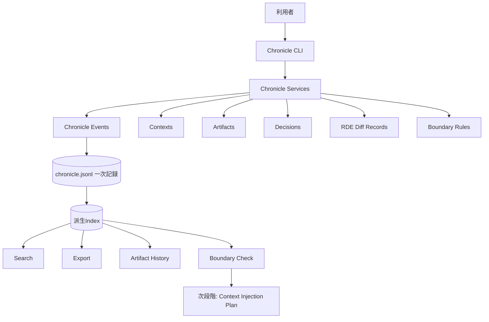
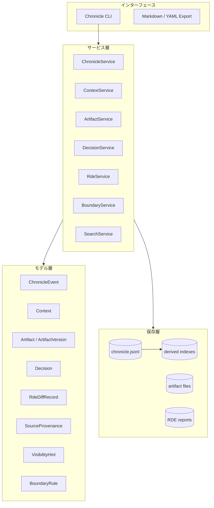
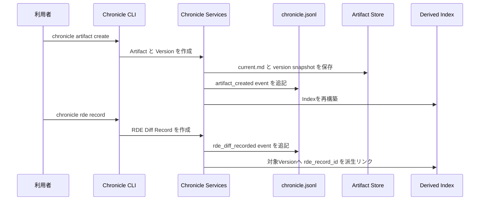

# Chronicle Stack アーキテクチャ

この文書は、Chronicle Stack の構造とデータの流れを説明します。

## 設計目標

Chronicle Stack は、AIとの共同作業で発生する文脈、判断、成果物、差分、出所を後から辿れるようにする local-first な基盤です。

主な目標は次の通りです。

- `chronicle.jsonl` を一次記録とする
- 派生Indexを再構築可能にする
- Artifactの履歴を保存する
- Decisionを成果物と結びつける
- RDEで意味変化を構造化して記録する
- Contextのscope、visibility、source、boundaryを扱う

## 全体構造

`chronicle.jsonl` が一次記録です。Indexは検索や表示のための派生データであり、再構築できます。

## レイヤ構造

## ArtifactとRDEの流れ

## Context Sovereignty 層

v0.2では、Contextを単なるメモではなく、選択可能で確認可能な文脈単位として扱います。

構成要素は次の通りです。

- Context Scope: 文脈の有効範囲
- Visibility Hint: 可視性に関する軽量ヒント
- Source Provenance: 出所記録
- Boundary Rule: include / exclude / warn の判断材料

これらは、次段階の Context Injection Plan に接続されます。

## 今後の拡張

Chronicle Stack は、まず local-first な記録と再構成可能性を優先します。

GraphRAG、Dashboard、外部連携、より高度な文脈選択は将来の拡張対象です。
