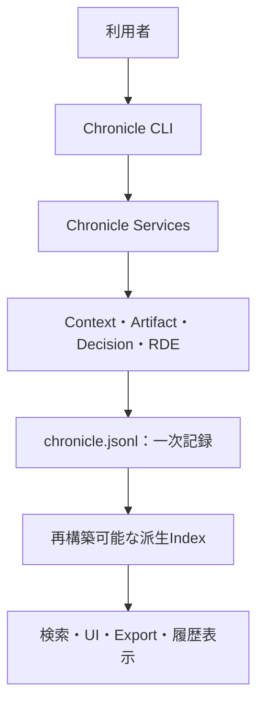

# Chronicle Stack 概要

**著者：Tomoyuki Kano**  
**組織：ZYX Corp株式会社**  
**作成日：2026年8月7日**  
**対象実装：Chronicle Stack v2.2.0**

## 1. 概要

Chronicle Stackは、AIとの共同作業で生じる**文脈、判断、成果物、意味差分、出所、境界ルール**を、後から再構成できる形で記録するlocal-first（ローカルを正本とする）基盤である。

AIを利用した執筆、調査、設計、開発では、完成した成果物だけが残り、その成果物がどのような問い、資料、指示、判断、修正を経て成立したのかが失われやすい。Chronicle Stackは最終結果だけでなく、そこへ至る過程を監査・継承可能な来歴として保持する。

中心価値は、単なる保存ではなく**再構成可能性**にある。

> Chronicle Stackは、人間とAIの共同作業から生じた文脈・判断・生成物・意味変化の来歴を、人間が保持し、検証し、選び直せるようにする基盤である。

## 2. 解決する課題

従来のAI利用では、次の情報が失われやすい。

- どの問いや文脈から生成が始まったのか
- どの資料や情報源を参照したのか
- 人間が何を指示し、AIが何を提案したのか
- どの案が採用、棄却、保留されたのか
- 修正によって意味がどのように変わったのか
- 人間が最終的に何を判断したのか
- 注意すべき文脈や未確認のAI解釈がいつ混入したのか

成果物だけを保存しても、これらの問いには答えられない。Chronicle Stackは、作業過程を構造化されたイベントとして記録し、後から判断と意味変化をたどれるようにする。

## 3. 基本原則

### 3.1 Local-first

記録の正本は利用者側のローカル環境に置く。特定のクラウドAI事業者のメモリ機能に文脈を委ねず、人間または組織が自らの記録を保持する。

### 3.2 JSONLを一次記録とする

`.chronicle/chronicle.jsonl` を安定した一次記録とする。検索インデックス、Web UI、エクスポート、Graph表現などは一次記録から再構築できる派生面として扱う。

### 3.3 文脈主権

人間が自らの文脈を確認し、利用範囲を選択し、必要に応じて除外・訂正・撤回できることを重視する。AIによる解釈を、本人の発言や確認済み事実へ自動的に昇格させない。

### 3.4 人間による最終判断

文脈の選択、外部共有、AIへの投入、判断の確定は、preview（事前確認）を経た明示的な人間の操作を基本とする。

### 3.5 意味変化の記録

文字列の変更量だけでなく、元の意図や設計思想がどのように保存、変換、補完、逸脱したかをRDE（Resonance Deviation Evaluation：共鳴偏差評価）によって記録する。ただし、RDEは正しさを証明する仕組みではない。

## 4. 記録する主要オブジェクト

| オブジェクト | 役割 |
|---|---|
| Context | 作業で用いる文脈、その範囲、可視性、出所を記録する |
| Artifact | 文書、コード、仕様などの成果物とバージョンを管理する |
| Decision | 案の採用、棄却、保留と、その理由を成果物に関連付ける |
| RDE Diff Record | 変更による意味差分を構造化して記録する |
| Source Provenance | 情報や生成物の出所を記録する |
| Boundary Rule | 文脈を含める、警告する、除外するための判断材料を与える |
| Audit | 操作、検査、共有などの監査情報を保持する |
| Lifecycle | 保持、封印、減衰、撤回など、記録の状態変化を扱う |

Source Provenanceは出所の記録であり、情報の真実性を暗号学的に証明するものではない。また、Boundary Ruleは現段階では助言的な分類規則であり、アクセス制御そのものではない。

## 5. システム構造

基本構造は、インターフェース層、サービス層、モデル層、保存層からなる。状態変更はChronicle Eventを経由してJSONLへ追記される。派生Indexは検索や表示を高速化するための補助データであり、正本ではない。

## 6. Chronicle Stackではないもの

現行のChronicle Stackは、次のものではない。

- クラウド型AIメモリサービス
- LLMエージェントの実行基盤
- 汎用ベクトルデータベース
- 完成済みGraphRAG実行環境
- AIが判断の正しさを自動証明するシステム
- 書き込み可能な常駐Webサービス
- 完成済みのネットワーク型分散連合

read-only local web UIは、記録を確認するための明示起動型インターフェースであり、権限を確定するauthority surfaceではない。AI IndexやGraph exportも一次記録ではなく、将来の接続に備えた派生面である。

## 7. ZYXの関連システムとの境界

Chronicle StackはZYXのアーキテクチャにおける共通来歴基盤だが、Ayane、Sayane、Kazaneを内部モジュールとして含むわけではない。

| システム | Chronicle Stackとの関係 |
|---|---|
| Ayane（綾音） | 現在の作業に必要な文脈を保持・再構成し、必要な記録をChronicle Stackと交換する |
| Sayane（紗綾音） | 人間の意図とAI生成物の意味差分や逸脱を監査し、RDE記録へ接続する |
| Kazane（風音） | 業務意図を実行へ編成し、その判断や成果をChronicle Stackへ記録する |
| Chronicle Stack | 各システムから独立して、文脈・判断・成果物・意味変化を来歴として保持する |

技術的な実行ログは「何を実行したか」を示すが、それだけでは判断や関係の来歴にはならない。Chronicle Stackは、実行の背景となった文脈、意図、判断、結果、意味変化を関連付ける。

## 8. 分散連合への発展

Chronicle Stackは将来的に、中央サービスが全利用者の文脈正本を保持しない分散連合を目指す。ただし、ネットワーク連携を先行させず、次の順序で安全境界を構築する。

1. ローカル一次記録と再構成可能性の確立
2. 監査、分類、保持、共有境界の整備
3. AI・検索機能との境界付き接続
4. Federation Packageによる手動・明示的共有
5. Manifest、署名、ハッシュによる整合性確認
6. Chronicle Object、メッセージ、ノード間信頼モデルの整備
7. ネットワーク型Federationの導入

Federation Packageは共有用パッケージであり、ネットワーク連合そのものではない。受信した記録を自動適用せず、inspect、verify、import previewを経て人間が判断する。

## 9. 現在地

Chronicle Stack v2.2.0では、local-first記録、CLI、派生Index、read-only UI、監査・境界・ライフサイクル、RDE、エクスポート、Federationの基礎面が実装されている。

一方、ネットワーク型分散連合、完全なGraphRAG、DID（Decentralized Identifier：分散型識別子）やPoPによる本人性証明、本格的な鍵管理、文脈SNSなどは将来段階に属する。ロードマップ上の構想と現在の安定機能を混同しないことが重要である。

## 10. ライセンス

オープンソース版は **AGPL-3.0-or-later** で公開されている。クローズドソース製品への組み込み、商用利用、SaaS・ホステッドサービスでの利用については、別途商用ライセンスを想定する。

## 11. まとめ

Chronicle Stackが守ろうとするのは、AIの回答そのものではない。人間とAIが共同で考え、選び、修正した過程と、その過程に宿る意味の来歴である。

成果物だけでなく、問い、文脈、判断、反論、出所、意味差分を再構成可能な形で残すことにより、人間や組織がAI時代にも自らの記憶と判断を失わないための基盤を形成する。

## 参考資料

- [Chronicle Stack GitHub Repository](https://github.com/zyx-corporation/chronicle-stack)
- [README](https://github.com/zyx-corporation/chronicle-stack/blob/main/README.md)
- [Product Overview](https://github.com/zyx-corporation/chronicle-stack/blob/main/docs/product-overview.md)
- [Architecture](https://github.com/zyx-corporation/chronicle-stack/blob/main/docs/architecture.md)
- [Overall Roadmap](https://github.com/zyx-corporation/chronicle-stack/blob/main/docs/roadmaps/overall-roadmap.md)

---

**ライセンス：CC BY-SA 4.0**
