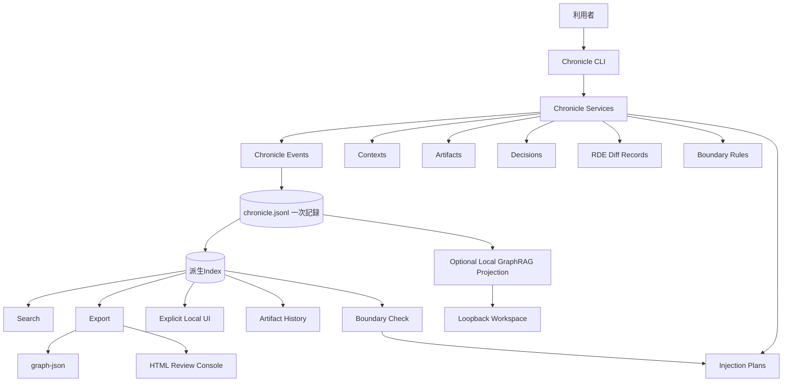

# Chronicle Stack Product Overview

## 解決したい課題

AIを使った執筆、設計、調査、開発では、成果物だけが残りやすくなります。Chronicle Stack は、次のような情報の喪失を防ぐことを目指します。

- どの文脈から生成されたのか
- どの指示で変更されたのか
- どの案が採用、棄却、保留されたのか
- どの差分が意味を変えたのか
- 出所や根拠がどこにあるのか
- 注意が必要な文脈がいつ混入したのか
- 人間が最終的に何を判断したのか

## 目指すもの

Chronicle Stack は、人間側が自分の文脈、問い、判断、生成物の来歴を保持し、必要に応じて選び直せるようにするための基盤です。

主な価値:

- **再構成可能性**: 後から生成過程と判断を辿れる
- **文脈主権**: 文脈をAI任せにせず、人間側で保持・選択する
- **Artifact履歴**: 成果物をバージョンとして追跡する
- **Decision記録**: 採用、棄却、保留の理由を残す
- **RDE Diff Record**: 意味変化を構造的に記録する
- **Source Provenance**: 出所を記録する
- **Boundary Rules**: 文脈の扱いに注意点と境界を与える

## 名称レイヤーの検討

将来の総称として、`Chronicle Yard` という呼称を検討対象として保持しています。
`Chronicle Yard` は、`Chronicle Stack` と関連製品群を束ねる名前です。問い、判断、
根拠、成果物、人、組織、AIエージェントが出入りし、クロニクル記録が置かれ、
整えられ、次の仕事へ接続される「場」を表します。

現時点では正式改名ではありません。`Chronicle Stack` は引き続き、この製品群の中核にある
クロニクル保管機構・技術構成名として扱います。`Chronicle Cloud`、`Chronicle API`、
Kazane連携、将来の利用者向けアプリに加えて、`csg-rag` や
`chronicle-external-query` のような下流ランタイム、検索、検証ワークスペースも、
`Chronicle Yard` 配下の関連製品または接続面として整理できます。

概要は [Chronicle Yard Overview](./yard/overview.ja.md) を参照してください。名称検討の詳細は
[Chronicle Yard Naming Note](./future/chronicle-yard-naming-note.md) を参照してください。

## Chronicle Stack ではないもの

Chronicle Stack は、汎用ベクトルデータベース、hosted / multi-user GraphRAG、正しさを自動判定する仕組み、クラウド型AIメモリサービス、LLMエージェント実行基盤、常駐Dashboardサーバーではありません。

補足:

- RDE は意味変化を構造的に記録する枠組みであり、正しさの証明ではありません
- Boundary Rules は警告や分類を支援するもので、強制的な保護機構ではありません
- graph export は依存なしの接続契約であり、外部モデルAPIを呼びません
- `chronicle ui` は明示起動型の read-only local web UI です
- `chronicle ui --workspace` はloopback-localの明示セッション内だけで、記録とモデル支援質問を有効にします
- workspaceのSQLite vector / graph DBは派生データであり、JSONLを正本として再構築できます
- どちらのUIモードもdaemon、hosted service、multi-user access control、correctness proofではありません

## システム全体像

`chronicle.jsonl` が一次記録です。派生Index、検索、エクスポート、履歴表示、Boundary Check、graph-json、HTML Review Console、Explicit Local UI、ローカルGraphRAG projectionは補助データまたは派生ビューです。

## 現在の実装位置

現在のプロダクト位置と残務順は次を参照してください。

- [Overall Roadmap](./roadmaps/overall-roadmap.md)
- [Local UI Implementation Roadmap](./roadmaps/local-ui-implementation-roadmap-2026-07.md)
- [Release Status v2.3.0](./releases/status/release-status-v2.3.0.md)

## 詳細参照

- [Architecture](./architecture.md)
- [Interface Contracts](./interface-contracts.md)
- [Data Model](./data-model.md)
- [Storage Format](./storage-format.md)
- [Testing Strategy](./testing-strategy.md)
