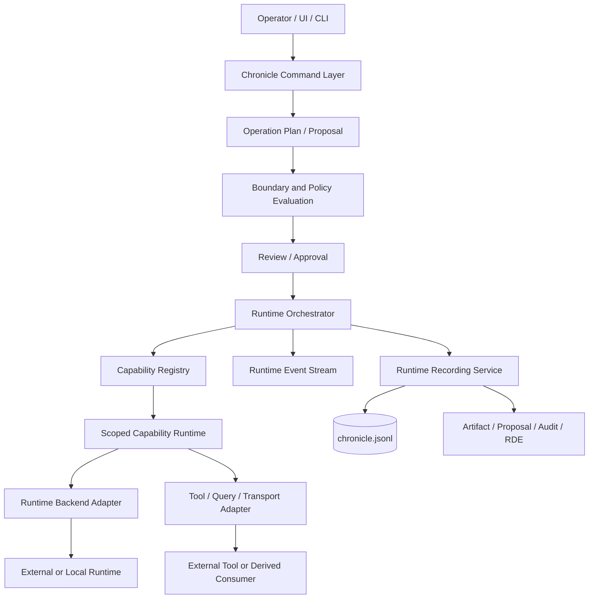

# Chronicle Stack Stage 2 基本仕様

Status: Draft  
Author: Tomoyuki Kano  
Scope: Runtime Composition and Capability Integration  
Related:

- `docs/architecture.md`
- `docs/interface-contracts.md`
- `docs/local-ai-runtime-architecture.md`
- `docs/interactive-ui-and-graphrag-roadmap.md`
- `docs/roadmaps/overall-roadmap.md`
- `docs/contributor-license-policy.md`
- `docs/stage-2/roadmap.md`
- `docs/stage-2/milestones.md`

## 1. 位置づけ

Stage 2 は、Chronicle Stack の local-first な記録・再構成・境界・レビュー基盤を維持したまま、外部AI、ローカルAI、検索エンジン、ツール、UI、メッセージ入力などを、交換可能かつ監査可能な実行能力として接続する段階である。

Stage 2 はリリース番号ではない。また、`docs/roadmaps/overall-roadmap.md` の Stage A〜E を置き換えない。全体ロードマップとの関係は次の通りである。

- Stage A / B で確立した一次記録、派生面、運用診断を前提とする。
- Stage C の Security and Boundary Baseline を実行能力の強制境界として利用する。
- Stage D の AI / Retrieval Boundary Expansion を、実装可能な Runtime / Capability 構造へ具体化する。
- Federation や外部Transportは、Stage 2 Coreの上に置かれる下流拡張とする。

Stage 2 の中心命題は次である。

```text
Chronicle Stack はAIアプリケーションの万能ホストにはならない。
Chronicleを正本として維持し、外部能力を制約付きAdapterとして合成する。
```

## 2. 背景

Chronicle Stack にはすでに次の基盤がある。

- `.chronicle/chronicle.jsonl` を一次記録とするEventモデル
- Context、Artifact、Decision、RDE、Audit、Lifecycle
- Boundary RuleとContext Injection Plan
- Runtime設定、明示的な外部呼出し、生成物のDraft扱い
- Proposal / Review / Applyによる変更経路
- vector、graph、Chronicle searchを派生面として扱う検索境界
- read-onlyを起点とするlocal UI

一方、今後複数のAI、検索基盤、外部ツール、Transportを接続する場合、個別Providerや個別機能を`RuntimeService`やCLIへ直接追加し続けると、次の問題が生じる。

1. Provider固有処理とChronicle記録処理が結合する。
2. 能力ごとの読取・書込・外部送信境界が不明確になる。
3. Preview、Review、Applyの経路が機能ごとに分岐する。
4. 実行中イベントと永続Chronicle Eventが混同される。
5. 外部実装を採用する際の著作権・ライセンス・出所管理が曖昧になる。

Stage 2 はこれらを、Backend Port、Capability Registry、Operation Plan、Scoped Runtime、Proposal Surfaceの組合せによって解決する。

## 3. 設計原則

### 3.1 Chronicle正本の維持

- `.chronicle/chronicle.jsonl` は引き続き一次記録である。
- Runtime、Plugin、UI、Transport、Graph、Vector、Cacheは派生面または外部能力である。
- 派生面の状態だけを根拠にChronicleの確定状態を変更してはならない。
- 変更成功は、対象状態、Decision、Audit、必要なEventが整合して永続化された場合だけ成立する。

### 3.2 Runtimeは明示的かつ既定無効

- 新規checkout、install、import、doctor、show、export、UI閲覧は外部AIを呼び出さない。
- 外部通信は設定だけでは開始せず、明示的なoperator actionを必要とする。
- AI生成結果はDraftであり、Review前に確定記録へ昇格しない。

### 3.3 Provider非依存

- Provider固有API、CLI、stream形式、resume tokenはBackend Adapter内部へ閉じ込める。
- Orchestrator、Record層、Review層は特定Providerを前提としない。
- Provider名は実装選択であり、安定したChronicle契約ではない。

### 3.4 Capability単位の境界

各実行能力は、少なくとも次を宣言する。

- 提供するoperation
- 入出力schema
- 必要なContext scope
- 読取可能なRecord種別
- 生成可能なProposal種別
- 外部通信の有無
- Mutationの有無
- Review要否
- 監査・RDE要否

### 3.5 Proposal-first

- AI、検索、外部ツールは原則として確定状態を直接変更しない。
- 変更能力はOperation PlanまたはProposalを生成する。
- Preview、Boundary評価、Review、Applyを経て初めて確定変更を行う。
- 直接Mutationが必要な運用機能は、個別ADRとfail-closed契約を必要とする。

### 3.6 実行イベントとChronicle Eventの分離

- token deltaや進捗通知は一時的Runtime Eventである。
- Chronicleへ保存するのは、要求、選択Context、外部送信、Tool実行要約、最終結果、Proposal、Decision、Audit、RDEなど、再構成に必要な意味的事実である。
- Operational Log、Security Audit、Runtime Trace、Chronicle Eventを同一保存期間・同一schemaで扱わない。

### 3.7 静的信頼から開始

- Stage 2では任意パッケージの自動検出・動的コードロードを行わない。
- Capabilityはコードレビュー済みの静的Registryへ登録する。
- 動的Plugin Ecosystemは、署名、権限、Sandbox、更新、失効、Supply-chain監査が設計された後の別Stageとする。

### 3.8 参照実装と著作権の分離

- 外部OSSからは原則として設計原理を抽出し、Chronicle要件から独自実装する。
- ソースコード、schema、コメント、テスト、文書表現を直接利用する場合は、出所、commit、path、license、著作権表示を記録する。
- MIT等の許諾コードであっても、ZYX単独著作物として扱わない。
- 商用ライセンス版への利用可能性は、OSS版への組込み可否とは別にRights Reviewする。

## 4. Stage 2 アーキテクチャ



### 4.1 レイヤ

#### Chronicle Command Layer

既存CLI、local UI、将来のTransportからの要求を、Chronicle上の明示的commandへ正規化する。

責務:

- operator identityとrequest metadataの受入れ
- PreviewかApplyかの区別
- idempotency keyの確認
- 既存Serviceへの委譲

#### Operation Plan / Proposal Layer

自然言語、UI入力、検索結果、外部メッセージを、検証可能な宣言形式へ変換する。

責務:

- operationとtargetの明示
- source refs、assumptions、constraintsの保持
- required review、RDE、rollback方針の宣言
- schema validation

#### Boundary and Policy Layer

既存Boundary、classification、allowed operation、external context policyを実行前に評価する。

責務:

- Context選択
- read / export / inject / reinterpret / publish / mutateの区別
- network、secret、visibility、retentionの確認
- deny / warn / require-review / allowの判定

#### Runtime Orchestrator

ProviderやCapabilityの詳細を知らず、1回の実行ライフサイクルを統括する。

責務:

- validated requestの受付
- Backend / Capability選択
- cancellationとtimeout
- Runtime Eventの集約
- final resultのRecord層への引渡し
- resource cleanup

#### Runtime Backend Adapter

LLM、embedding、query engine等のProvider固有処理を担う。

責務:

- requestのProvider形式への変換
- Provider固有streamの共通Runtime Eventへの変換
- provider-specific resume / session tokenの隔離
- errorのChronicle共通errorへの正規化

#### Capability Registry

利用可能な能力とManifestを静的に管理する。

責務:

- capability IDの一意性
- versionとschemaの公開
- operationからCapabilityへの解決
-重複・未登録・無効Capabilityの拒否

#### Scoped Capability Runtime

Capabilityへ必要最小限の操作面だけを注入する。

責務:

- 選択済みContextのread-only参照
- Proposal生成
- 許可されたArtifact領域への限定アクセス
- scoped network client
-監査付きEvent emission

CapabilityへChronicle root、JsonlStore、全Context一覧、秘密情報を直接渡してはならない。

#### Runtime Recording Service

一時的Runtime Eventから、永続化すべき意味的記録を選び、既存Chronicleモデルへ接続する。

責務:

- SourceProvenance
- Runtime configuration reference
- selected Context refs
- request / response summary
- generated Artifact / Proposal
- ReviewStatus、Confidence
- Auditと必要なRDE draft

## 5. 基本データ契約

以下はStage 2で導入する概念契約である。具体的なPydanticフィールドは実装ADRで確定する。

### 5.1 RuntimeBackend

```python
class RuntimeBackend(Protocol):
    backend_id: str
    capabilities: BackendCapabilities

    async def run(
        self,
        request: RuntimeRequest,
    ) -> AsyncIterator[RuntimeEvent]:
        ...
```

BackendはChronicle Storeへ直接書き込まない。

### 5.2 BackendCapabilities

```text
streaming
cancellation
session_resume
tool_calling
structured_output
attachments
local_execution
network_required
```

Capabilityは機能の有無を表すhintであり、権限付与ではない。

### 5.3 RuntimeRequest

最低限、次を持つ。

- request_id
- operation
- input payload
- selected Context refs
- source refs
- runtime config ref
- operator ref
- review policy
- timeout / cancellation metadata
- record policy

### 5.4 RuntimeEvent

共通種別の初期候補:

```text
runtime.started
runtime.context_prepared
runtime.request_dispatched
runtime.output_delta
runtime.tool_requested
runtime.tool_completed
runtime.result_completed
runtime.cancelled
runtime.failed
runtime.cleaned_up
```

`runtime.output_delta`は既定ではChronicleへ永続化しない。

### 5.5 CapabilityManifest

最低限、次を持つ。

- capability_id
- version
- operations
- input_schema_ref
- output_schema_ref
- context_requirements
- record_access
- network_policy
- mutation_policy
- review_policy
- audit_policy
- rde_policy

### 5.6 OperationPlan

```yaml
plan_id: plan_...
plan_type: artifact_update
operation: artifact.propose_update
target_refs:
  - art_...
source_refs:
  - evt_...
  - ctx_...
steps:
  - step_id: step_1
    capability: artifact.proposal
    action: replace_section
    parameters:
      section: implementation-policy
assumptions: []
constraints:
  preserve: []
review:
  required: true
rde:
  required: true
rollback:
  mode: compensating_event
```

Planは実行命令そのものではなく、検証・説明・Review可能な中間表現である。

### 5.7 ProposalSurface

GUIへ任意実行コードを渡す代わりに、Review対象と許可操作を宣言する。

最低限、次を持つ。

- surface_type
- surface_version
- proposal_id
- read_model_ref
- allowed_actions
- mutation_session requirement
- display hints

安定契約はJSON surfaceであり、Vue、React、HTML等の具体的componentは派生実装とする。

### 5.8 UpstreamAdoptionRecord

外部参照実装からの採用判断を記録する。

最低限、次を持つ。

- source_project
- source_url
- source_commit
- source_paths
- source_license
- adoption_mode
- copied_source
- target_paths
- design_summary
- notice_location
- rights_review_status

`adoption_mode`初期値:

```text
conceptual_reimplementation
external_dependency
direct_source_reuse
rejected
```

## 6. 既存Event Contractとの関係

Stage 2初期実装では、`chronicle.jsonl`のPrimary Stable契約を不要に破壊しない。

初期方針:

- Runtime結果は既存の`assistant_output` payloadを拡張して記録可能とする。
- Proposalは既存Proposal RecordとEventを利用する。
- Review、Decision、Audit、RDEは既存モデルへ接続する。
- 新EventTypeが必要な場合は、EventType-to-payload契約を先に更新する。
- token stream、heartbeat、progressは永続EventTypeにしない。
- optional field追加を優先し、既存必須fieldの意味変更を避ける。

## 7. セキュリティ境界

### 7.1 禁止事項

Stage 2 Coreでは次を禁止する。

- 未署名・未登録コードの動的ロード
- CapabilityからJsonlStoreへの直接書込み
- Capabilityから全Contextへの無制限アクセス
- UI表示を経由した暗黙Mutation
- Runtime設定だけを根拠とする自動外部送信
- secret、credential、raw tokenのChronicle Event保存
- 外部メッセージの無検証Command化

### 7.2 Network

- `allow_network=false`を既定とする。
- 接続先、operation、送信Context、redaction profileをPreview可能にする。
- external call madeの事実をSourceProvenanceとAuditへ残す。
- timeout、retry、cancellationはBackend契約に含める。

### 7.3 Mutation

- Capabilityは原則Proposalのみ生成する。
- ApplyはChronicle Command Layerが担う。
- 重複request IDを拒否する。
- DecisionとAuditの永続化に失敗した場合は成功扱いしない。

### 7.4 Transport

外部Transportから受け取ったmessageは、直ちにoperator commandとみなさない。

```text
External Message
  -> Transport Envelope
  -> Identity / Consent / Boundary Check
  -> User Input or Context Record
  -> Explicit Command Promotion
```

Transport Adapter本体はStage 2 Coreの外部packageまたは別repositoryを原則とする。

## 8. 参照実装研究と著作権方針

Stage 2の設計検討では、`receptron/mulmoclaude`を実装済みAI-native application architectureの参照例として研究した。

参照時点:

- Repository: `https://github.com/receptron/mulmoclaude`
- Reviewed commit: `6fcf15f3d976ebb499d6946b791a95290dafbf1a`
- License observed at repository root: MIT License
- Copyright notice observed: Satoshi Nakajima and the members of Receptron

Stage 2で参考にした設計領域:

- LLM backendとorchestrationの分離
- feature-specific integrationをhost coreから分離する構造
- capabilityごとのscoped runtime
- runtime plugin registryの衝突・名前空間・ロード境界
- messaging transportとagent runtimeの分離
-自然言語から構造化定義を生成し、決定論的engineが実行する構成

採用方針:

1. 既定は`conceptual_reimplementation`とする。
2. Chronicle Stack固有の要件、用語、型、テストから独自設計する。
3. 上流コード、コメント、schema、テストを直接コピーしない。
4. 直接利用が必要な場合は、個別PRでRights Reviewを行う。
5. MITコードを直接含める場合は、該当Copyright NoticeとPermission Noticeを保持する。
6. AGPL公開版への組込み可否と、ZYX商用ライセンス版へ含める権利を分けて確認する。
7. AI支援実装でも、上流コードとの実質的類似性と出所をレビューする。

## 9. 非対象

Stage 2では次を完成対象にしない。

- 汎用AIデスクトップまたはSaaSホスト
- 任意npm / Python packageの自動Pluginロード
- Plugin marketplace
- 完全なRBAC / ABAC / tenant isolation
- Providerの正しさ保証
- 自動承認・自動公開
- Networked Federation transportの完成
- Cloud queue、hosted relay、always-on agent
- GraphRAG / vector DB / graph DBのCore内蔵
- GUI frameworkの公開標準化
- Chronicle Eventへの全token・全tool payload保存

## 10. 完了条件

Stage 2は、次をすべて満たした場合に完了とする。

1. Provider固有実行が`RuntimeBackend`の後ろへ分離されている。
2. OrchestratorがProviderに依存せず、fake backendで統合テストできる。
3. CapabilityがManifestを持ち、静的Registryで一意に解決される。
4. CapabilityはScoped Runtime越しにのみContext、Proposal、Networkへアクセスする。
5. AIまたは外部Toolによる変更はOperation Plan / ProposalとしてPreviewできる。
6. Review / Apply / Audit / Decision / RDEとの接続がfail-closedである。
7. Runtime EventとChronicle Eventが区別されている。
8. 外部呼出しは既定無効かつ明示的である。
9. `chronicle.jsonl`と既存CLI JSON契約に不要なbreaking changeがない。
10. Upstream Adoption RecordとThird-party Notice運用が導入されている。
11. ruff、pytest、CLI integration、JSONL rebuild、failure-path testsが通る。
12. Stage 2機能を無効にした状態で既存Chronicle運用が変化しない。

## 11. RDE差異監査

### Preserved

- Chronicle正本と再構成可能性
- local-first
- explicit execution
- Boundary、Review、Audit、RDE
- 派生Indexと外部Runtimeの非権威性

### Transformed

- 単一`RuntimeService`中心の実装をBackend、Orchestrator、Recordingへ分離する。
- Provider設定をCapabilityとPolicyを伴う実行契約へ拡張する。
- UIを表示面からProposal Review Surfaceへ拡張する。

### Supplemented

- Capability Manifest / Registry
- Scoped Capability Runtime
- Portable Runtime Event Stream
- Operation Plan DSL
- Upstream Adoption Record
-著作権・商用再利用を分離したRights Review

### Unresolved

- Capability ManifestをPublic Stable-ish契約にする時期
- Operation Planの永続化粒度
- Runtime Eventの標準公開範囲
- Proposal Surfaceのversioning方針
- Transport runtimeを別repositoryにするかpackageにするか
- direct source reuseを商用版へ含める際の最終法務判断

### Deviation Risks

- Chronicle StackがAI application hostへ変質する。
- Plugin拡張性を優先し、文脈境界とSupply-chain安全性が後退する。
- Runtime traceの大量保存がChronicleの意味的記録を埋没させる。
- MIT許諾を、上流著作権の消滅またはZYXの独占権と誤認する。
- Provider抽象化が最低公倍数化し、Chronicle固有のReview / Provenanceを失う。

### Next Update Policy

- 各Milestone開始前にADRを作成する。
- Stable contractへの昇格は実装・failure test・migration方針が揃ってから行う。
- 外部参照コードを直接利用する判断が生じた時点でRights Reviewを再実施する。
- Stage 2終了時に、基本仕様と実装差分のRDE監査を行う。
