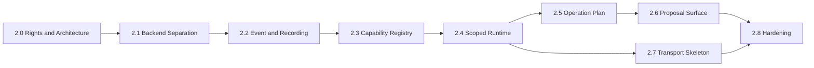

# Chronicle Stack Stage 2 実装ロードマップ

Status: Draft  
Author: Tomoyuki Kano  
Parent specification: `docs/stage-2/basic-specification.md`  
Milestones: `docs/stage-2/milestones.md`

## 1. 目的

このロードマップは、Stage 2「Runtime Composition and Capability Integration」を、Chronicle Stackの一次記録、Boundary、Review、Audit、RDEを壊さずに実装する順序を定義する。

Stage 2は、機能一覧を一度に実装する計画ではない。各Laneで先に契約とfailure conditionを定義し、その後に最小実装、統合、安定化を行う。

基本順序は次である。

```text
Rights / Contract Baseline
    -> Runtime Backend Separation
    -> Runtime Event and Recording Separation
    -> Static Capability Registry
    -> Scoped Capability Runtime
    -> Operation Plan / Proposal Integration
    -> Proposal Surface Integration
    -> Transport Boundary Skeleton
    -> Hardening and Stage Exit Audit
```

## 2. 実装原則

1. 各Phaseは前Phaseの安定契約だけに依存する。
2. `.chronicle/chronicle.jsonl`への変更はoptional fieldまたは新EventType追加を優先する。
3. 新EventTypeは、payload契約、migration、rebuild testを伴わなければ追加しない。
4. Runtime、Capability、UI、Transportは既定無効または明示的opt-inとする。
5. 変更経路はProposal / Review / Applyを基本とする。
6. Provider固有処理をChronicle Serviceへ直接追加しない。
7. 外部OSSの直接利用は、Rights Review完了前に実装へ入れない。
8. 各Phaseは正常系より先にfailure conditionを列挙する。
9. CLI parityを保ち、UIだけに存在するMutation経路を作らない。
10. Stage 2全体を一つの巨大PRにしない。

## 3. Workstream構成

### W1. Rights and Provenance

外部参照実装、依存パッケージ、AI支援コードの出所と権利を管理する。

### W2. Runtime Core

Backend Port、Orchestrator、Cancellation、Runtime Event、Recordingを分離する。

### W3. Capability Composition

Manifest、Registry、Scoped Runtime、Policy Bindingを実装する。

### W4. Proposal and Review

Operation Plan、Proposal、Boundary、Review、Apply、RDEを統合する。

### W5. Interaction Surface

CLI、local UI、Proposal Surface、将来Transportの受入境界を実装する。

### W6. Verification and Operations

doctor、audit、failure tests、migration、release readiness、Stage Exit RDEを整備する。

## 4. Phase 2.0 — Rights and Architecture Baseline

### 目的

実装開始前に、Stage 2の設計境界と外部参照の権利処理を固定する。

### Deliverables

- `docs/stage-2/basic-specification.md`
- `docs/stage-2/roadmap.md`
- `docs/stage-2/milestones.md`
- `docs/provenance/upstream-study-mulmoclaude.md`
- `docs/provenance/upstream-adoption-ledger.yaml`
- `THIRD_PARTY_NOTICES.md`の初期運用方針
- Runtime Backend Port ADR
- Capability Registry ADR
- Operation Plan ADR
- Proposal Surface ADR

### Required decisions

- Stage 2を実装プログラム段階として扱い、リリース番号と分離する。
- MulmoClaude参照は原則`conceptual_reimplementation`とする。
- 任意動的PluginロードはStage 2非対象とする。
- Capability Adapterは静的Registryから開始する。
- Runtime EventをPrimary Chronicle Eventへ自動昇格させない。

### Failure conditions

- 参照元commitまたはlicenseが記録されていない。
- 上流コードを利用しているのに`copied_source=false`となっている。
- 商用版利用権とAGPL版組込み可否が混同されている。
- Stage 2が既存Overall Roadmapを上書きしている。

### Exit criteria

- 基本仕様、ロードマップ、マイルストーンがreview済みである。
- Rights Reviewの手順と記録場所が確定している。
- 最初のRuntime ADRが承認されている。

## 5. Phase 2.1 — Runtime Backend Separation

### 目的

現在のRuntime実行からProvider固有処理を分離し、OrchestratorがBackendを交換可能にする。

### Target structure

```text
src/chronicle/runtime/
  contracts.py
  events.py
  orchestrator.py
  cancellation.py
  recording.py
  backends/
    disabled.py
    local.py
    http.py
    fake.py
```

最終的なpathはADRで確定する。

### Deliverables

- `RuntimeBackend` Protocol
- `BackendCapabilities`
- `RuntimeRequest`
- 共通Runtime Error hierarchy
- `DisabledBackend`
- `FakeBackend`
- 現行local/http処理をAdapterへ移す移行計画
- Orchestrator単体テスト
- cancellation / timeout / cleanupテスト

### Implementation sequence

1. 現行`RuntimeService`の責務表を作成する。
2. Provider非依存入力とProvider固有入力を分離する。
3. Fake BackendでOrchestrator契約を先にテストする。
4. Disabled Backendを既定実装とする。
5. Local / HTTP処理を段階的にAdapterへ移す。
6. 旧呼出し経路をCompatibility Facadeとして残す。
7. CLI出力とexit codeの互換性を検証する。

### Failure conditions

- BackendがChronicle Storeへ直接書き込む。
- Provider固有response objectがService層へ漏れる。
- cancellation後にsubprocess、socket、一時fileが残る。
- Backend切替が実行中requestへ影響する。
- Fake Backendなしでは統合テストできない。
- Stage 2無効時にも外部通信が発生する。

### Exit criteria

- OrchestratorのテストがProviderなしで通る。
- Local / HTTPの少なくとも一方がAdapter経由で動作する。
- 現行CLIの主要Runtime commandにbreaking changeがない。
- Provider固有failureが共通Chronicle Errorへ変換される。

## 6. Phase 2.2 — Runtime Event and Recording Separation

### 目的

実行中の進捗Eventと、Chronicleへ残す意味的Eventを分離する。

### Deliverables

- `RuntimeEvent`共通種別
- Runtime Event consumer contract
- `RuntimeRecordingService`
- Runtime resultからSourceProvenance、Artifact、Proposal、Auditへのmapping
- Operational Log / Runtime Trace / Chronicle Event分類表
- retention方針

### Implementation sequence

1. 現行Runtime executionで発生するeventを棚卸しする。
2. ephemeral、operational、security、chronicleの4分類を行う。
3. common Runtime Eventへ正規化する。
4. Recording Policyを導入する。
5. `assistant_output`既存payloadとの互換mappingを実装する。
6. record=false経路がChronicleを変更しないことを検証する。

### Failure conditions

- token deltaが既定で`chronicle.jsonl`へ保存される。
- raw credential、session token、secret headerがEventへ入る。
- runtime failedでも成功Eventが記録される。
- record=falseでArtifactまたはEventが作成される。
- Chronicle Eventだけから最終resultの出所を辿れない。

### Exit criteria

- ephemeral eventとpersistent eventが型・保存経路で分離されている。
- runtime resultにprovider、model、source refs、review statusが付く。
- failed / cancelled / timeoutの記録契約がテストされている。

## 7. Phase 2.3 — Static Capability Registry

### 目的

Runtime、検索、Artifact処理、将来のToolを、宣言されたCapabilityとして静的に登録する。

### Deliverables

- `CapabilityManifest`
- `CapabilityRegistry`
- capability ID naming policy
- schema reference policy
- duplicate / disabled / missing capability diagnostics
- doctor check
- initial built-in capabilities

### Initial capability candidates

```text
runtime.summarize
runtime.invoke
runtime.retrieve_plan
artifact.propose_update
context.injection_plan
review.apply_proposal
query.handoff.create
```

名称はADRで確定する。

### Implementation sequence

1. 既存Service operationをCapability候補へ分類する。
2. Manifestの必須fieldを決める。
3. 静的Registryを実装する。
4. duplicate、unknown、disabledをfail closedで処理する。
5. doctorへRegistry検査を追加する。
6. CLIにread-only list / showを追加する。

### Failure conditions

- capability ID衝突時にfirst-write-winsで黙って継続する。
- Manifestなしで実行できる裏口が残る。
- Provider名とCapability IDが同一概念になる。
- Capability登録が`chronicle.jsonl`一次契約へ依存する。
- schema version不一致が警告だけで実行される。

### Exit criteria

- 全Stage 2 capabilityが静的Registryから解決される。
- duplicate / unknown capabilityは実行前に拒否される。
- Registry一覧が外部通信なしで確認できる。
- Registryは派生・再生成可能である。

## 8. Phase 2.4 — Scoped Capability Runtime

### 目的

Capabilityへ必要最小限のContext、Proposal、Network、Artifact操作だけを渡す。

### Deliverables

- Scoped Context Reader
- Proposal Writer
- Scoped Artifact Access
- Policy-bound Network Client
- Audit Emitter
- capability execution context factory
- deny-by-default policy

### Implementation sequence

1. Capabilityが必要とするPortを列挙する。
2. raw Service / Store injectionを禁止する。
3. read-only Context projectionを実装する。
4. Proposal Writerを実装する。
5. Network Clientにdestination / operation policyを適用する。
6. Capability単位のaudit metadataを付ける。
7. forbidden accessのnegative testを追加する。

### Failure conditions

- CapabilityがChronicle root pathを受け取る。
- CapabilityがJsonlStoreへ直接書き込める。
- selected Context以外をID推測で取得できる。
- Network Clientが任意destinationへ接続できる。
- CapabilityがReviewなしに確定Artifactを更新できる。
- Audit failureでもMutation成功となる。

### Exit criteria

- CapabilityはScoped Runtime以外の内部Serviceを参照しない。
- forbidden Context / Artifact / network accessがテストで拒否される。
- mutation capabilityはProposalのみ生成する。

## 9. Phase 2.5 — Operation Plan DSL

### 目的

AIまたは外部Toolの提案を、Preview、検証、Review、再実行可能な中間表現へ変換する。

### Deliverables

- `OperationPlan` model
- plan schema version
- plan validator
- boundary evaluation mapping
- plan preview CLI
- plan record policy
- plan-to-proposal converter
- idempotent apply path

### Implementation sequence

1. Artifact updateなど単一operationで最小Planを設計する。
2. target refs、source refs、assumptions、constraintsを必須化する。
3. plan生成とplan実行を分離する。
4. previewを既定とする。
5. Review decisionとapply commandを接続する。
6. RDE requirementをPlan上で宣言可能にする。
7. multi-step planは単一operation安定後に追加する。

### Failure conditions

- Plan生成と同時にMutationされる。
- source refsなしのAI planが確定可能である。
- assumptionが通常のfactとして保存される。
- stale target versionへ適用できる。
- 同じplanを重複applyできる。
- partial apply後に成功扱いされる。

### Exit criteria

- Artifact proposalの一経路がPlan経由で動作する。
- preview、record、approve、applyが分離されている。
- duplicate applyとstale targetが拒否される。
- apply後のDecision、Audit、Event、RDE linkを再構成できる。

## 10. Phase 2.6 — Proposal Surface Protocol

### 目的

local UIへ任意Plugin codeを導入せず、Proposal Reviewに必要な表示・操作契約を定義する。

### Deliverables

- `ProposalSurface` JSON contract
- surface version policy
- read model endpoints
- allowed action contract
- CLI parity matrix
- local UI renderer
- mutation session連続性検査

### Initial surfaces

```text
artifact_change_review
context_injection_review
runtime_invocation_preview
rde_diff_review
external_send_preview
```

### Implementation sequence

1. 既存review detailをsurface contractへ写像する。
2. read-only rendererを作る。
3. allowed actionsを固定列挙する。
4. mutation token、request ID、proposal IDを関連付ける。
5. CLI applyと同じCommand Layerへ接続する。
6. Decision / Audit両方の永続化を成功条件にする。

### Failure conditions

- UI componentがStoreへ直接Mutationする。
- surface payloadに実行可能scriptを含める。
- allowed actions外のoperationをclientが指定できる。
- Preview時とApply時でproposal identityが失われる。
- UI経路だけCLIより強い権限を持つ。

### Exit criteria

- 少なくともArtifact Proposalをsurface経由でreviewできる。
- UI MutationはCommand Layerへ委譲される。
- duplicate request、expired session、stale proposalが拒否される。

## 11. Phase 2.7 — Transport Boundary Skeleton

### 目的

Telegram、Slack、Email等を実装する前に、外部messageをChronicleへ安全に受け入れる共通Envelopeと昇格手順を定義する。

### Deliverables

- `ExternalInteractionEnvelope`
- transport identity evidence model
- attachment reference model
- message-to-user-input recording path
- command promotion policy
- mock transport adapter
- separate runtime/package boundary ADR

### Scope restriction

このPhaseでは実サービスAdapterを大量に実装しない。MockまたはCLI transportでEnvelope contractを検証する。

### Failure conditions

- 外部messageが即時にCapability commandとして実行される。
- transport user IDだけでChronicle actor identityを確定する。
- attachment bytesを無制限にEvent payloadへ保存する。
- webhook secretやplatform tokenをChronicleへ記録する。
- transport固有APIがChronicle Coreへ流入する。

### Exit criteria

- Mock Transportからuser_input / Context candidateを記録できる。
- command promotionが明示操作として分離されている。
- transport-specific実装をCore外へ配置できる契約がある。

## 12. Phase 2.8 — Operational Hardening

### 目的

Stage 2を継続運用可能にし、既存Chronicleの安全性と互換性を確認する。

### Deliverables

- Stage 2 doctor checks
- capability / backend status
- runtime cleanup diagnostics
- adoption ledger validation
- migration and compatibility tests
- security negative tests
- performance baseline
- operator runbook
- release readiness document
- Stage Exit RDE report

### Required test categories

- unit tests
- service integration tests
- CLI integration tests
- local UI smoke tests
- JSONL rebuild tests
- corruption tolerance tests
- cancellation / timeout tests
- duplicate apply tests
- stale proposal tests
- forbidden capability access tests
- external network disabled tests
- rights metadata validation tests

### Failure conditions

- Stage 2無効時に既存commandの挙動が変わる。
- derived RegistryまたはRuntime cacheが一次記録化する。
- failed execution後にcleanupされないresourceがある。
- doctorがdangerous configurationを正常扱いする。
- provenanceなしのdirect source reuseが残る。

### Exit criteria

- `ruff check src/ tests/`が通る。
- `pytest`が通る。
- local UI smokeが通る。
- Stage 2無効時の回帰テストが通る。
- migration / rebuildが通る。
- security and rights reviewが完了する。
- Stage Exit RDEで重大な逸脱が未解決になっていない。

## 13. PR分割方針

推奨PR単位:

1. Stage 2 docs and provenance policy
2. Runtime contracts and fake backend
3. Runtime orchestrator and disabled backend
4. Local / HTTP backend migration
5. Runtime event and recording split
6. Capability manifest and static registry
7. Scoped runtime read ports
8. Proposal writer and mutation denial
9. Operation Plan model and preview
10. Plan-to-proposal integration
11. Proposal Surface read contract
12. Proposal Surface apply integration
13. Transport envelope and mock adapter
14. doctor / audit / hardening
15. Stage Exit documentation and RDE

各PRは、対応Milestone、failure conditions、非対象、rights classificationを本文に記載する。

## 14. 依存関係



## 15. 並行実行可能な作業

Phase 2.1開始後、次は限定的に並行できる。

- W1 Rights and Provenanceの継続整備
- Proposal Surfaceのread-only schema検討
- Transport Envelopeの要求整理
- doctor checkの設計
- fake backend / mock transportのtest fixture作成

ただし、Capability Registry実装はRuntime契約の確定前に開始しない。Operation Plan applyはScoped RuntimeとProposal契約の確定前に開始しない。

## 16. Rollback方針

- 新Runtimeはfeature flagまたはconfigで無効化可能にする。
- 旧RuntimeService facadeを移行期間中維持する。
- JSONLへ書く新payloadは旧readerがunknown optional fieldとして読める形を優先する。
- 新EventType追加時はreaderのunknown event toleranceを確認する。
- UI surfaceはread-only fallbackを持つ。
- Capability Registry不整合時は実行を停止し、既存inspect/export機能は維持する。

## 17. Stage Exit後の候補

Stage 2完了後に初めて、次を別Stageとして検討する。

- signed capability package
- sandboxed dynamic adapter loading
- capability marketplace
- networked transport runtime
- hosted relay
- multi-node execution
- federated capability delegation
- external agent interoperability protocol

これらはStage 2の完了条件ではない。
